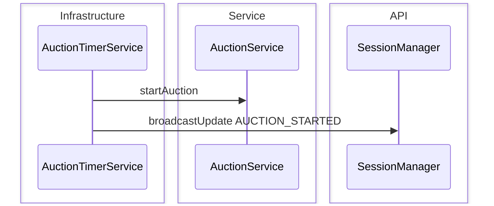
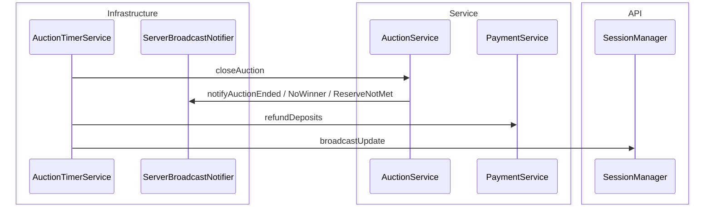

# Auction Lifecycle Sequence Diagram

Scheduler nền mở/đóng phiên: OPEN → RUNNING → FINISHED hoặc CANCELED, hoàn cọc, broadcast trạng thái.  
`AuctionTimerService` quét mỗi 1 giây; bỏ qua close nếu anti-sniping vừa gia hạn `endTime`.

**Mục đích:** Hiểu ai trigger chuyển trạng thái khi không có request client.  
**Use case:** Phiên tự start/close đúng giờ, không winner, reserve không đạt, refund deposit.  
**Trong code:** `AuctionTimerService.scanAndProcess` → `AuctionService.startAuction` / `closeAuction`.

## Start OPEN → RUNNING

## Close RUNNING

Anti-sniping: nếu `endTime` vừa gia hạn, timer bỏ qua close. Trạng thái domain: [CoreDomainClassDiagram.md](./CoreDomainClassDiagram.md).
