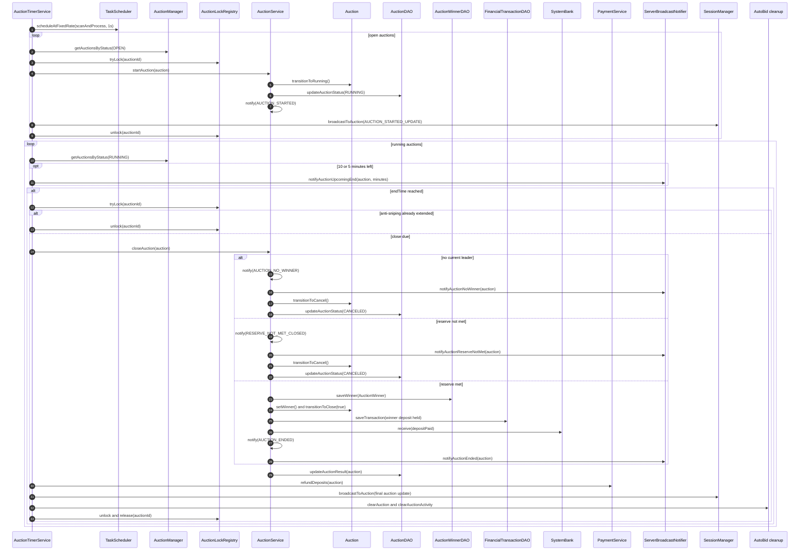

# Auction Lifecycle Sequence Diagram

```mermaid
sequenceDiagram
    autonumber
    participant Timer as AuctionTimerService
    participant Scheduler as TaskScheduler
    participant Manager as AuctionManager
    participant Lock as AuctionLockRegistry
    participant AuctionSvc as AuctionService
    participant Auction
    participant AuctionDAO
    participant WinnerDAO as AuctionWinnerDAO
    participant TxDAO as FinancialTransactionDAO
    participant Bank as SystemBank
    participant PaymentSvc as PaymentService
    participant Broadcast as ServerBroadcastNotifier
    participant Sessions as SessionManager
    participant AutoBid as AutoBid cleanup

    Timer->>Scheduler: scheduleAtFixedRate(scanAndProcess, 1s)

    loop open auctions
        Timer->>Manager: getAuctionsByStatus(OPEN)
        Timer->>Lock: tryLock(auctionId)
        Timer->>AuctionSvc: startAuction(auction)
        AuctionSvc->>Auction: transitionToRunning()
        AuctionSvc->>AuctionDAO: updateAuctionStatus(RUNNING)
        AuctionSvc->>AuctionSvc: notify(AUCTION_STARTED)
        Timer->>Sessions: broadcastToAuction(AUCTION_STARTED_UPDATE)
        Timer->>Lock: unlock(auctionId)
    end

    loop running auctions
        Timer->>Manager: getAuctionsByStatus(RUNNING)
        opt 10 or 5 minutes left
            Timer->>Broadcast: notifyAuctionUpcomingEnd(auction, minutes)
        end

        alt endTime reached
            Timer->>Lock: tryLock(auctionId)
            alt anti-sniping already extended
                Timer->>Lock: unlock(auctionId)
            else close due
                Timer->>AuctionSvc: closeAuction(auction)

                alt no current leader
                    AuctionSvc->>AuctionSvc: notify(AUCTION_NO_WINNER)
                    AuctionSvc->>Broadcast: notifyAuctionNoWinner(auction)
                    AuctionSvc->>Auction: transitionToCancel()
                    AuctionSvc->>AuctionDAO: updateAuctionStatus(CANCELED)
                else reserve not met
                    AuctionSvc->>AuctionSvc: notify(RESERVE_NOT_MET_CLOSED)
                    AuctionSvc->>Broadcast: notifyAuctionReserveNotMet(auction)
                    AuctionSvc->>Auction: transitionToCancel()
                    AuctionSvc->>AuctionDAO: updateAuctionStatus(CANCELED)
                else reserve met
                    AuctionSvc->>WinnerDAO: saveWinner(AuctionWinner)
                    AuctionSvc->>Auction: setWinner() and transitionToClose(true)
                    AuctionSvc->>TxDAO: saveTransaction(winner deposit held)
                    AuctionSvc->>Bank: receive(depositPaid)
                    AuctionSvc->>AuctionSvc: notify(AUCTION_ENDED)
                    AuctionSvc->>Broadcast: notifyAuctionEnded(auction)
                end

                AuctionSvc->>AuctionDAO: updateAuctionResult(auction)
                Timer->>PaymentSvc: refundDeposits(auction)
                Timer->>Sessions: broadcastToAuction(final auction update)
                Timer->>AutoBid: clearAuction and clearAuctionActivity
                Timer->>Lock: unlock and release(auctionId)
            end
        end
    end
```
