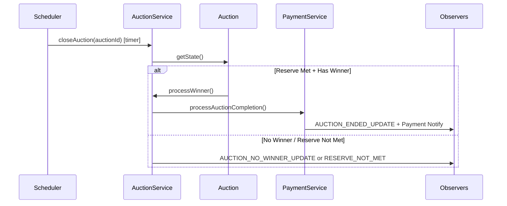

# Sequence Diagram — Auction Lifecycle + Auto-Close

```mermaid
sequenceDiagram
    participant Scheduler
    participant AuctionSvc as AuctionService
    participant Auction
    participant PaymentSvc as PaymentService
    participant Observers

    Scheduler->>AuctionSvc: closeAuction(auctionId) [timer]
    AuctionSvc->>Auction: getState()
    
    alt Reserve Met + Has Winner
        Auction->>AuctionSvc: processWinner()
        AuctionSvc->>PaymentSvc: processAuctionCompletion()
        PaymentSvc->>Observers: AUCTION_ENDED_UPDATE + Payment Notify
    else No Winner / Reserve Not Met
        AuctionSvc->>Observers: AUCTION_NO_WINNER_UPDATE or RESERVE_NOT_MET
    end
```