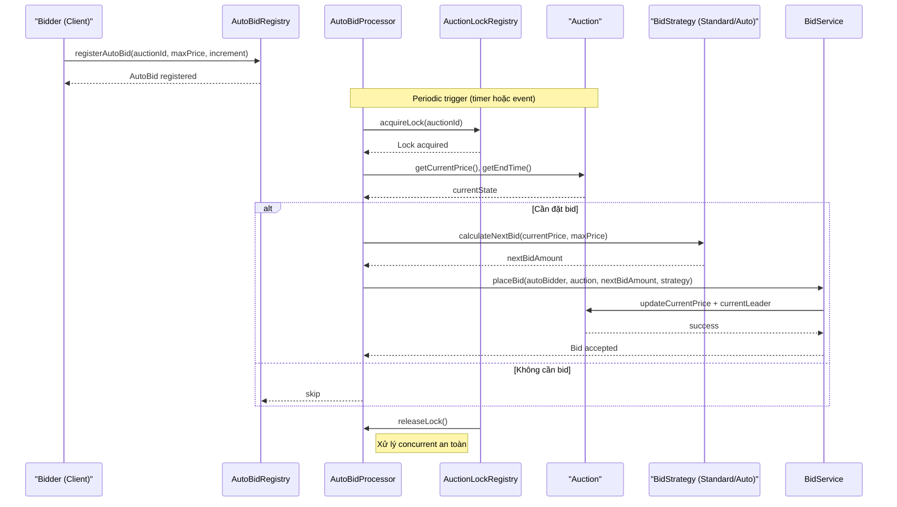

# Auto-Bid Engine Sequence Diagram

```mermaid
sequenceDiagram
    participant Bidder as "Bidder (Client)"
    participant AutoBidRegistry
    participant AutoBidProcessor
    participant AuctionLockRegistry
    participant Auction as "Auction"
    participant BidStrategy as "BidStrategy (Standard/Auto)"
    participant BidService

    Bidder->>AutoBidRegistry: registerAutoBid(auctionId, maxPrice, increment)
    AutoBidRegistry-->>Bidder: AutoBid registered

    Note over AutoBidProcessor,Auction: Periodic trigger (timer hoặc event)

    AutoBidProcessor->>AuctionLockRegistry: acquireLock(auctionId)
    AuctionLockRegistry-->>AutoBidProcessor: Lock acquired

    AutoBidProcessor->>Auction: getCurrentPrice(), getEndTime()
    Auction-->>AutoBidProcessor: currentState

    alt Cần đặt bid
        AutoBidProcessor->>BidStrategy: calculateNextBid(currentPrice, maxPrice)
        BidStrategy-->>AutoBidProcessor: nextBidAmount
        AutoBidProcessor->>BidService: placeBid(autoBidder, auction, nextBidAmount, strategy)
        BidService->>Auction: updateCurrentPrice + currentLeader
        Auction-->>BidService: success
        BidService-->>AutoBidProcessor: Bid accepted
    else Không cần bid
        AutoBidProcessor-->>AutoBidRegistry: skip
    end

    AuctionLockRegistry->>AutoBidProcessor: releaseLock()
    Note right of AutoBidProcessor: Xử lý concurrent an toàn
```