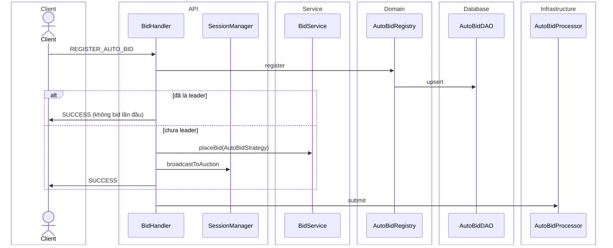
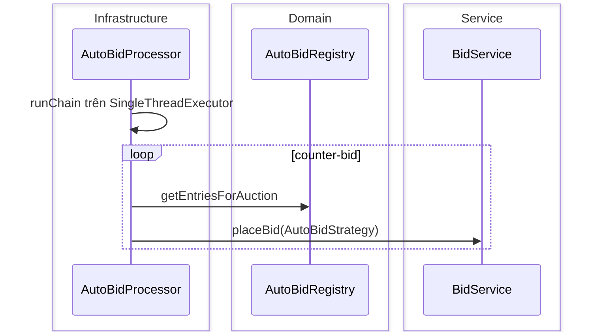

# Auto-Bid Sequence Diagram

Đăng ký `REGISTER_AUTO_BID` (có thể bid lần đầu nếu chưa là leader) và chuỗi counter-bid async qua `AutoBidProcessor`.  
Registry persist `AutoBidDAO`; chain chạy trên executor riêng từng phiên.

**Mục đích:** Hiểu thứ tự đăng ký và bid tự động sau `PLACE_BID`.  
**Use case:** User bật/tắt auto-bid, bị vượt giá tự counter, leader đăng ký khi đang dẫn.  
**Trong code:** `BidHandler` + `AutoBidRegistry` + `AutoBidProcessor.submit`.

## Đăng ký

## Chuỗi async (`AutoBidProcessor`)

Class: [AutoBidSubsystemClassDiagram.md](./AutoBidSubsystemClassDiagram.md)
