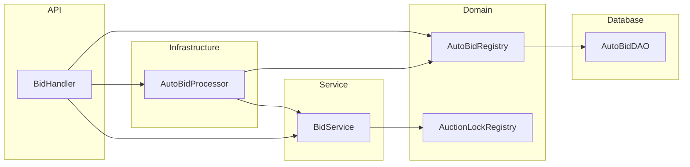

# Auto-Bid Subsystem Class Diagram

Auto-bid: `AutoBidRegistry` (memory + DB), `AutoBidProcessor` (chuỗi async), `BidStrategy` / `AutoBidStrategy`, liên kết `BidHandler` và `BidService`.

**Mục đích:** Hiểu cấu trúc auto-bid tách khỏi bid thủ công.  
**Use case:** Debug counter-bid, đăng ký/hủy auto-bid, performance chain sau `PLACE_BID`.  
**Trong code:** `com.group13.auction.strategy.AutoBid*`, `BidHandler` handlers REGISTER/UPDATE/CANCEL_AUTO_BID.

`BidStrategy` · `StandardBidStrategy` · `AutoBidStrategy` — sequence: [AutoBidSequenceDiagram.md](./AutoBidSequenceDiagram.md)
