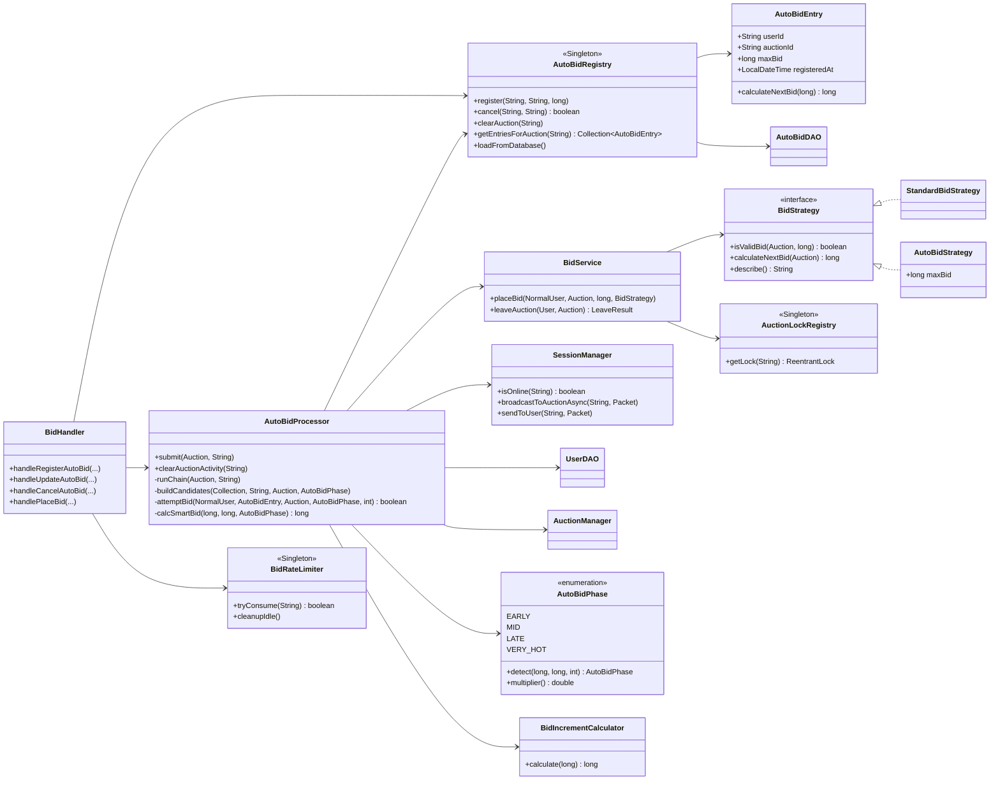

# Auto-Bid Subsystem Class Diagram

```mermaid
classDiagram
    direction LR

    class BidHandler {
        +handleRegisterAutoBid(...)
        +handleUpdateAutoBid(...)
        +handleCancelAutoBid(...)
        +handlePlaceBid(...)
    }
    class AutoBidProcessor {
        +submit(Auction, String)
        +clearAuctionActivity(String)
        -runChain(Auction, String)
        -buildCandidates(Collection, String, Auction, AutoBidPhase)
        -attemptBid(NormalUser, AutoBidEntry, Auction, AutoBidPhase, int) boolean
        -calcSmartBid(long, long, AutoBidPhase) long
    }
    class AutoBidRegistry {
        <<Singleton>>
        +register(String, String, long)
        +cancel(String, String) boolean
        +clearAuction(String)
        +getEntriesForAuction(String) Collection~AutoBidEntry~
        +loadFromDatabase()
    }
    class AutoBidEntry {
        +String userId
        +String auctionId
        +long maxBid
        +LocalDateTime registeredAt
        +calculateNextBid(long) long
    }
    class BidService {
        +placeBid(NormalUser, Auction, long, BidStrategy)
        +leaveAuction(User, Auction) LeaveResult
    }
    class BidStrategy {
        <<interface>>
        +isValidBid(Auction, long) boolean
        +calculateNextBid(Auction) long
        +describe() String
    }
    class StandardBidStrategy
    class AutoBidStrategy {
        +long maxBid
    }
    class AutoBidPhase {
        <<enumeration>>
        EARLY
        MID
        LATE
        VERY_HOT
        +detect(long, long, int) AutoBidPhase
        +multiplier() double
    }
    class BidIncrementCalculator {
        +calculate(long) long
    }
    class BidRateLimiter {
        <<Singleton>>
        +tryConsume(String) boolean
        +cleanupIdle()
    }
    class AuctionLockRegistry {
        <<Singleton>>
        +getLock(String) ReentrantLock
    }
    class SessionManager {
        +isOnline(String) boolean
        +broadcastToAuctionAsync(String, Packet)
        +sendToUser(String, Packet)
    }

    BidHandler --> AutoBidRegistry
    BidHandler --> AutoBidProcessor
    BidHandler --> BidRateLimiter
    AutoBidProcessor --> AutoBidRegistry
    AutoBidProcessor --> BidService
    AutoBidProcessor --> SessionManager
    AutoBidProcessor --> UserDAO
    AutoBidProcessor --> AuctionManager
    AutoBidProcessor --> AutoBidPhase
    AutoBidProcessor --> BidIncrementCalculator
    AutoBidRegistry --> AutoBidEntry
    AutoBidRegistry --> AutoBidDAO
    BidService --> BidStrategy
    BidService --> AuctionLockRegistry
    BidStrategy <|.. StandardBidStrategy
    BidStrategy <|.. AutoBidStrategy
```
