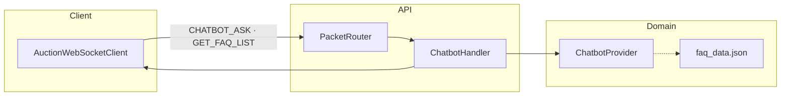

# Chatbot Architecture

FAQ qua WebSocket: `CHATBOT_ASK`, `CHATBOT_GET_FAQ_LIST`. Handler mỏng; tìm kiếm trong `ChatbotProvider` (load `faq_data.json` một lần).  
Không yêu cầu đăng nhập.

**Mục đích:** Hiểu module chatbot tách khỏi auction/payment.  
**Use case:** User hỏi FAQ trên app, tra cứu theo category, relevance scoring theo query.  
**Trong code:** `ChatbotHandler`, `ChatbotProvider`, `PacketRouter`.

