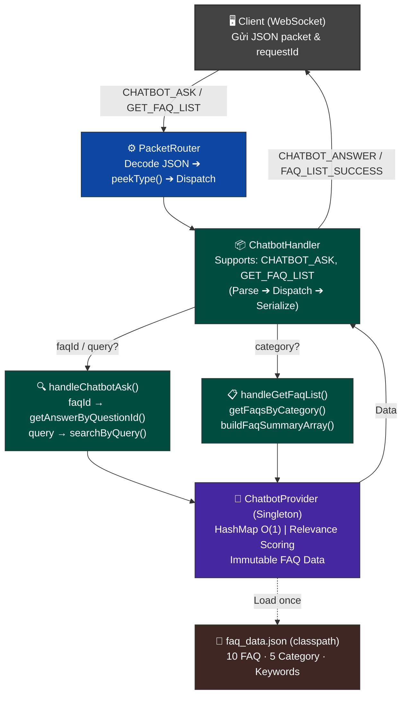

# Kiến trúc Chatbot

```mermaid
graph TD
    %% Định nghĩa Style
    classDef client fill:#424242,stroke:#333,stroke-width:2px,color:#fff;
    classDef router fill:#0d47a1,stroke:#333,stroke-width:1px,color:#fff;
    classDef handler fill:#004d40,stroke:#333,stroke-width:1px,color:#fff;
    classDef provider fill:#4527a0,stroke:#333,stroke-width:1px,color:#fff;
    classDef data fill:#3e2723,stroke:#333,stroke-width:1px,color:#fff;

    %% Các thành phần
    Client["🖥️ Client (WebSocket)<br/>Gửi JSON packet & requestId"]:::client
    
    Router["⚙️ PacketRouter<br/>Decode JSON ➔ peekType() ➔ Dispatch"]:::router
    
    MainHandler["📦 ChatbotHandler<br/>Supports: CHATBOT_ASK, GET_FAQ_LIST<br/>(Parse ➔ Dispatch ➔ Serialize)"]:::handler

    AskSub["🔍 handleChatbotAsk()<br/>faqId → getAnswerByQuestionId()<br/>query → searchByQuery()"]:::handler
    
    ListSub["📋 handleGetFaqList()<br/>getFaqsByCategory()<br/>buildFaqSummaryArray()"]:::handler

    Provider["🧠 ChatbotProvider (Singleton)<br/>HashMap O(1) | Relevance Scoring<br/>Immutable FAQ Data"]:::provider

    JsonDB["📄 faq_data.json (classpath)<br/>10 FAQ · 5 Category · Keywords"]:::data

    %% Luồng dữ liệu
    Client -- "CHATBOT_ASK / GET_FAQ_LIST" --> Router
    Router --> MainHandler
    
    MainHandler -- "faqId / query?" --> AskSub
    MainHandler -- "category?" --> ListSub
    
    AskSub --> Provider
    ListSub --> Provider
    
    Provider -.->|Load once| JsonDB
    
    %% Phản hồi
    Provider -- "Data" --> MainHandler
    MainHandler -- "CHATBOT_ANSWER / FAQ_LIST_SUCCESS" --> Client
```