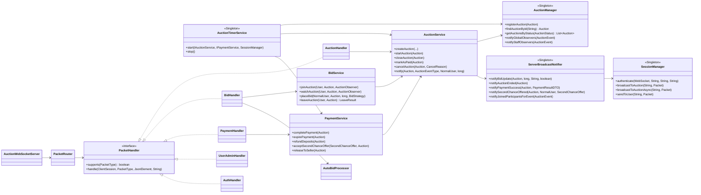

# Backend Class Diagrams

Backend được chia thành nhiều class diagram theo từng subsystem riêng biệt

- [CoreDomainClassDiagram.md](./CoreDomainClassDiagram.md)
- [ServiceLayerClassDiagram.md](./ServiceLayerClassDiagram.md)
- [PaymentSubsystemClassDiagram.md](./PaymentSubsystemClassDiagram.md)
- [AutoBidSubsystemClassDiagram.md](./AutoBidSubsystemClassDiagram.md)
- [RealtimeObserverClassDiagram.md](./RealtimeObserverClassDiagram.md)

