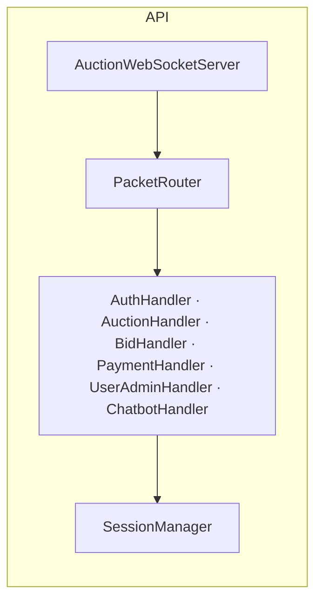
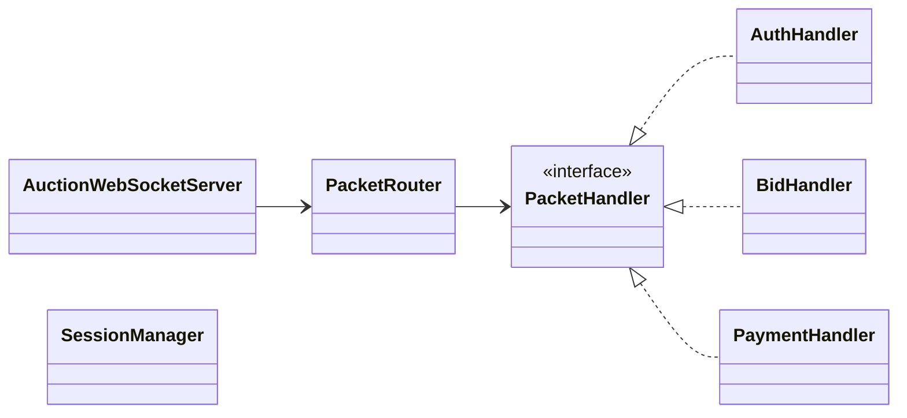
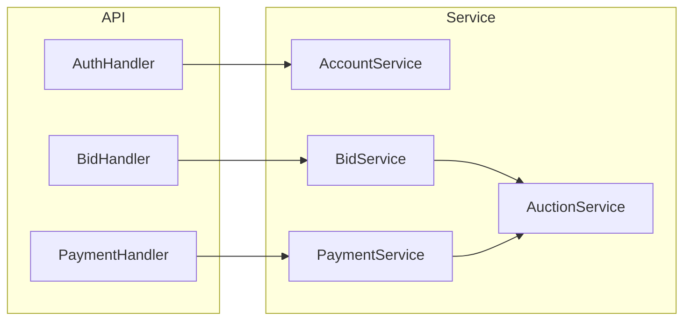

# Backend Class Diagrams — Index

Chỉ mục toàn bộ diagram kỹ thuật của **auction-server**, kèm sơ đồ wiring API handlers.

**Mục đích:** Điều hướng developer tới đúng diagram theo chủ đề (domain, payment, bid, realtime…).  
**Use case:** Onboarding, review kiến trúc, tra cứu nhanh trước khi đọc code.  
**Trong code:** `ServerMain` khởi động WebSocket **8080**, image HTTP **8081**, `AuctionTimerService` mỗi 1 giây.

## Danh sách diagram

| Chủ đề | File |
|--------|------|
| Domain | [CoreDomainClassDiagram.md](./CoreDomainClassDiagram.md) |
| Service | [ServiceLayerClassDiagram.md](./ServiceLayerClassDiagram.md) |
| Payment | [PaymentSubsystemClassDiagram.md](./PaymentSubsystemClassDiagram.md) |
| Auto-bid | [AutoBidSubsystemClassDiagram.md](./AutoBidSubsystemClassDiagram.md) |
| Observer / broadcast | [RealtimeObserverClassDiagram.md](./RealtimeObserverClassDiagram.md) |
| Realtime flows | [RealtimeBroadcastViaObserverSequenceDiagram.md](./RealtimeBroadcastViaObserverSequenceDiagram.md) |
| Place bid | [PlaceBidSequenceDiagram.md](./PlaceBidSequenceDiagram.md) |
| Lifecycle | [AuctionLifecycleSequenceDiagram.md](./AuctionLifecycleSequenceDiagram.md) |

## API — handlers

## Handler → Service

