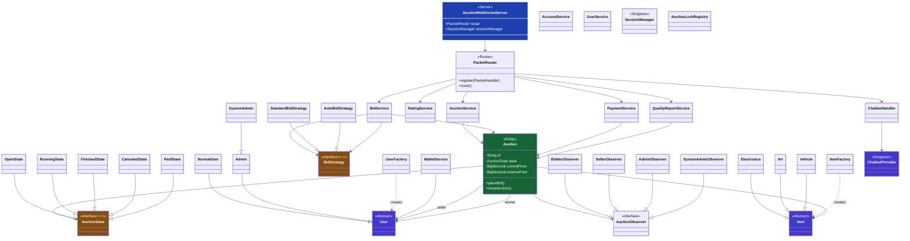

# Class Diagram - Server Logic (Inheritance & Package Structure)

```mermaid
classDiagram
    direction TB

    %% ==================== TOP LEVEL - SERVICES ====================
    class AuctionWebSocketServer {
        <<Server>>
        +PacketRouter router
        +SessionManager sessionManager
    }

    class PacketRouter {
        <<Router>>
        +register(PacketHandler)
        +route()
    }

    %% ==================== SERVICES LAYER ====================
    class AuctionService
    class BidService
    class PaymentService
    class QualityReportService
    class RatingService
    class WalletService
    class AccountService
    class UserService

    AuctionWebSocketServer --> PacketRouter
    PacketRouter --> AuctionService
    PacketRouter --> BidService
    PacketRouter --> PaymentService
    PacketRouter --> QualityReportService
    PacketRouter --> RatingService

    %% ==================== CORE DOMAIN - AUCTION ====================
    class Auction {
        <<Entity>>
        -String id
        -AuctionState state
        -BigDecimal currentPrice
        -BigDecimal reservePrice
        +placeBid()
        +closeAuction()
    }

    class AuctionState {
        <<interface>> <<State Pattern>>
    }
    class OpenState
    class RunningState
    class FinishedState
    class CanceledState
    class PaidState

    Auction --> AuctionState
    OpenState --|> AuctionState
    RunningState --|> AuctionState
    FinishedState --|> AuctionState
    CanceledState --|> AuctionState
    PaidState --|> AuctionState

    %% ==================== BID & STRATEGY ====================
    class BidStrategy {
        <<interface>> <<Strategy Pattern>>
    }
    class StandardBidStrategy
    class AutoBidStrategy

    BidService --> BidStrategy
    StandardBidStrategy --|> BidStrategy
    AutoBidStrategy --|> BidStrategy

    %% ==================== OBSERVER PATTERN ====================
    class AuctionObserver {
        <<interface>>
    }
    class BidderObserver
    class SellerObserver
    class AdminObserver
    class SystemAdminObserver

    Auction --> AuctionObserver
    BidderObserver --|> AuctionObserver
    SellerObserver --|> AuctionObserver
    AdminObserver --|> AuctionObserver
    SystemAdminObserver --|> AuctionObserver

    %% ==================== USER HIERARCHY ====================
    class User {
        <<Abstract>>
    }
    class NormalUser
    class Admin
    class SystemAdmin

    NormalUser --|> User
    Admin --|> User
    SystemAdmin --|> Admin

    %% ==================== ITEM HIERARCHY ====================
    class Item {
        <<Abstract>>
    }
    class Electronics
    class Art
    class Vehicle

    Electronics --|> Item
    Art --|> Item
    Vehicle --|> Item

    %% ==================== FACTORIES ====================
    class ItemFactory
    class UserFactory

    ItemFactory ..> Item : creates
    UserFactory ..> User : creates

    %% ==================== OTHER IMPORTANT CLASSES ====================
    class ChatbotProvider {
        <<Singleton>>
    }
    class ChatbotHandler
    class SessionManager {
        <<Singleton>>
    }
    class AuctionLockRegistry

    PacketRouter --> ChatbotHandler
    ChatbotHandler --> ChatbotProvider

    %% ==================== RELATIONSHIPS ====================
    AuctionService --> Auction
    BidService --> Auction
    BidService --> BidStrategy
    PaymentService --> Auction
    QualityReportService --> Auction
    WalletService --> User

    Auction --> Item
    Auction --> User : seller
    Auction --> User : winner

    style AuctionWebSocketServer fill:#1e40af, color:white, stroke:white
    style Auction fill:#166534, color:white
    style User fill:#4338ca, color:white
    style Item fill:#4338ca, color:white
    style BidStrategy fill:#854d0e, color:white
    style AuctionState fill:#854d0e, color:white
    style ChatbotProvider fill:#4338ca, color:white
```