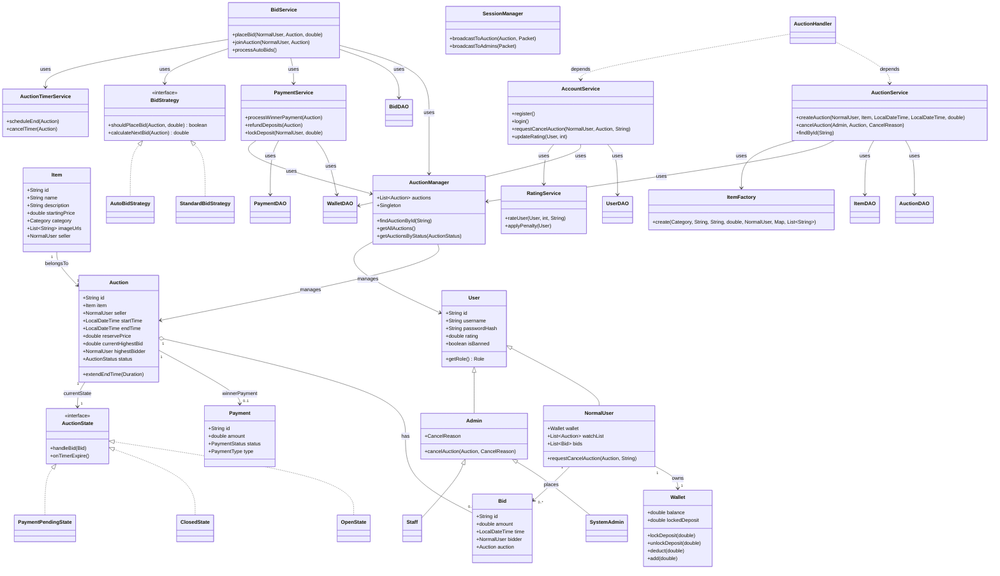

# Class Diagram - Domain Model + Service Layer

## Giải thích Kiến trúc

1. Domain Model
Hệ thống được xây dựng xung quanh các thực thể cốt lõi sau:

* User là lớp gốc, được kế thừa bởi NormalUser (người dùng thông thường) và Admin (quản trị viên).  
* NormalUser sở hữu Wallet để quản lý số dư và tiền cọc (locked deposit).  
* Item đại diện cho sản phẩm đấu giá, chứa thông tin mô tả và hình ảnh.  
* Auction là trung tâm của domain, quản lý vòng đời phiên đấu giá, trạng thái và thông tin người thắng cuộc. 
* Bid ghi nhận các lần ra giá.

**Mối quan hệ chính:**

* Một Auction thuộc về một Item và một NormalUser (người bán).  
* Một Auction có thể chứa nhiều Bid.

2. Service Layer & Business Logic
Các service được thiết kế theo nguyên tắc Single Responsibility và high cohesion:

* AuctionService: Quản lý vòng đời phiên đấu giá (tạo, cập nhật, hủy).
* BidService: Xử lý logic ra giá, kiểm tra điều kiện tham gia, phối hợp với auto-bid và thanh toán.
* PaymentService: Xử lý thanh toán cho người thắng cuộc và hoàn tiền cọc cho người thua.
* AccountService & RatingService: Quản lý tài khoản và hệ thống đánh giá uy tín.
* AuctionTimerService: Quản lý bộ đếm thời gian kết thúc phiên.
* AuctionManager (Singleton) đóng vai trò trung tâm, giữ trạng thái trong bộ nhớ của tất cả các phiên đấu giá đang hoạt động.

3. Design Patterns được áp dụng

* Factory Pattern: ItemFactory, UserFactory.
* Strategy Pattern: BidStrategy (hỗ trợ linh hoạt các chiến lược tự động ra giá).
* State Pattern: AuctionState cho phép Auction thay đổi hành vi theo từng trạng thái (Open, Closed, PaymentPending…).
* Observer Pattern: Thông qua SessionManager để broadcast thông báo realtime.
* Repository/DAO Pattern: Tách biệt logic truy xuất dữ liệu.