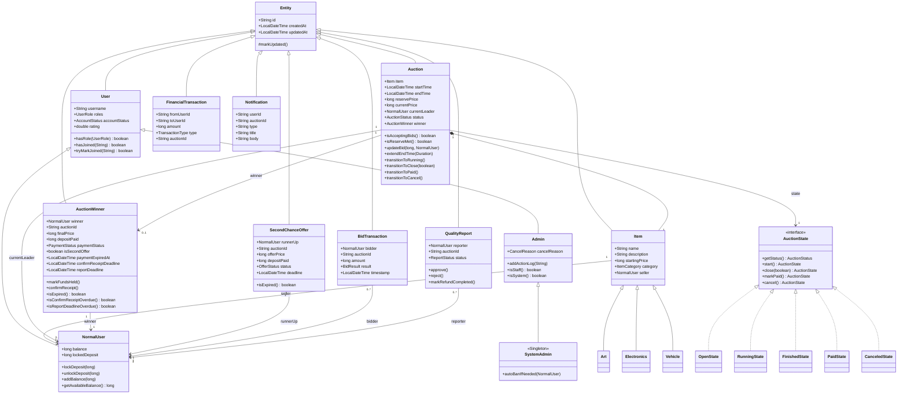

# Core Domain Class Diagram

```mermaid
classDiagram
    direction TB

    class Entity {
        +String id
        +LocalDateTime createdAt
        +LocalDateTime updatedAt
        #markUpdated()
    }

    class User {
        +String username
        +UserRole roles
        +AccountStatus accountStatus
        +double rating
        +hasRole(UserRole) boolean
        +hasJoined(String) boolean
        +tryMarkJoined(String) boolean
    }
    class NormalUser {
        +long balance
        +long lockedDeposit
        +lockDeposit(long)
        +unlockDeposit(long)
        +addBalance(long)
        +getAvailableBalance() long
    }
    class Admin {
        +CancelReason cancelReason
        +addActionLog(String)
        +isStaff() boolean
        +isSystem() boolean
    }
    class SystemAdmin {
        <<Singleton>>
        +autoBanIfNeeded(NormalUser)
    }

    class Item {
        +String name
        +String description
        +long startingPrice
        +ItemCategory category
        +NormalUser seller
    }
    class Art
    class Electronics
    class Vehicle

    class Auction {
        +Item item
        +LocalDateTime startTime
        +LocalDateTime endTime
        +long reservePrice
        +long currentPrice
        +NormalUser currentLeader
        +AuctionStatus status
        +AuctionWinner winner
        +isAcceptingBids() boolean
        +isReserveMet() boolean
        +updateBid(long, NormalUser)
        +extendEndTime(Duration)
        +transitionToRunning()
        +transitionToClose(boolean)
        +transitionToPaid()
        +transitionToCancel()
    }

    class AuctionState {
        <<interface>>
        +getStatus() AuctionStatus
        +start() AuctionState
        +close(boolean) AuctionState
        +markPaid() AuctionState
        +cancel() AuctionState
    }
    class OpenState
    class RunningState
    class FinishedState
    class PaidState
    class CanceledState

    class AuctionWinner {
        +NormalUser winner
        +String auctionId
        +long finalPrice
        +long depositPaid
        +PaymentStatus paymentStatus
        +boolean isSecondOffer
        +LocalDateTime paymentExpiredAt
        +LocalDateTime confirmReceiptDeadline
        +LocalDateTime reportDeadline
        +markFundsHeld()
        +confirmReceipt()
        +isExpired() boolean
        +isConfirmReceiptOverdue() boolean
        +isReportDeadlineOverdue() boolean
    }
    class SecondChanceOffer {
        +NormalUser runnerUp
        +String auctionId
        +long offerPrice
        +long depositPaid
        +OfferStatus status
        +LocalDateTime deadline
        +isExpired() boolean
    }
    class BidTransaction {
        +NormalUser bidder
        +String auctionId
        +long amount
        +BidResult result
        +LocalDateTime timestamp
    }
    class FinancialTransaction {
        +String fromUserId
        +String toUserId
        +long amount
        +TransactionType type
        +String auctionId
    }
    class QualityReport {
        +NormalUser reporter
        +String auctionId
        +ReportStatus status
        +approve()
        +reject()
        +markRefundCompleted()
    }
    class Notification {
        +String userId
        +String auctionId
        +String type
        +String title
        +String body
    }

    Entity <|-- User
    Entity <|-- Item
    Entity <|-- Auction
    Entity <|-- AuctionWinner
    Entity <|-- SecondChanceOffer
    Entity <|-- BidTransaction
    Entity <|-- FinancialTransaction
    Entity <|-- QualityReport
    Entity <|-- Notification
    User <|-- NormalUser
    User <|-- Admin
    Admin <|-- SystemAdmin
    Item <|-- Art
    Item <|-- Electronics
    Item <|-- Vehicle
    AuctionState <|.. OpenState
    AuctionState <|.. RunningState
    AuctionState <|.. FinishedState
    AuctionState <|.. PaidState
    AuctionState <|.. CanceledState

    Auction "1" *-- "1" Item
    Item "1" --> "1" NormalUser : seller
    Auction "1" --> "0..1" NormalUser : currentLeader
    Auction "1" --> "0..1" AuctionWinner : winner
    Auction "1" --> "1" AuctionState : state
    AuctionWinner "1" --> "1" NormalUser : winner
    SecondChanceOffer "1" --> "1" NormalUser : runnerUp
    BidTransaction "0..*" --> "1" NormalUser : bidder
    QualityReport "0..*" --> "1" NormalUser : reporter
```
