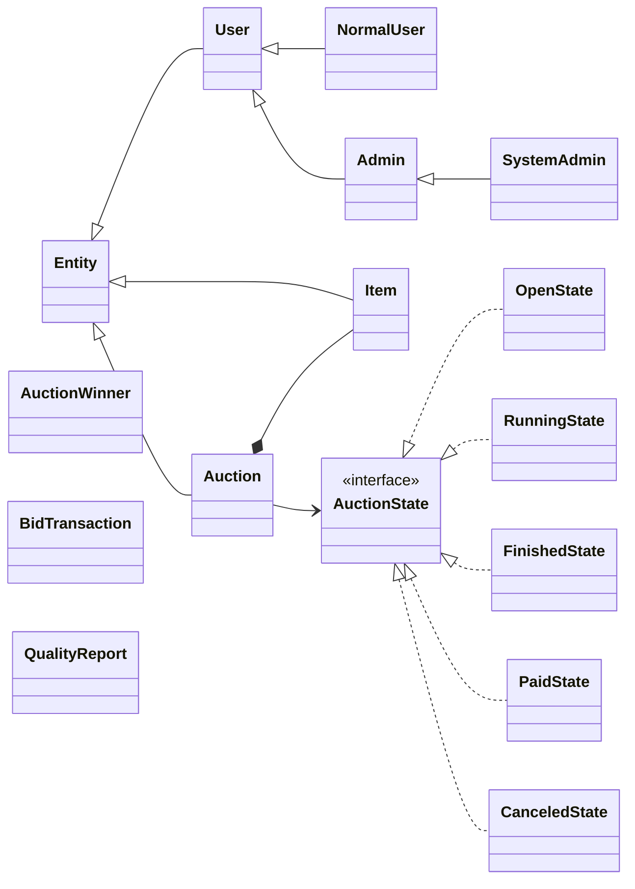
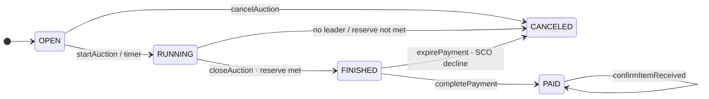

# Core Domain Class Diagram

Mô hình nghiệp vụ cốt lõi: `User`, `Item`, `Auction`, state pattern, `AuctionWinner`, bid và quality report.  
Kèm sơ đồ chuyển trạng thái phiên đấu giá (OPEN → RUNNING → FINISHED / PAID / CANCELED).

**Mục đích:** Hiểu entity và quy tắc chuyển trạng thái trước khi đọc service/timer.  
**Use case:** Thiết kế feature mới trên auction, debug sai status, review domain model.  
**Trong code:** `com.group13.auction.model.*`, `AuctionManager.loadDataFromDatabase()`.

## Trạng thái phiên (`Auction`)

Timer: [AuctionLifecycleSequenceDiagram.md](./AuctionLifecycleSequenceDiagram.md)
