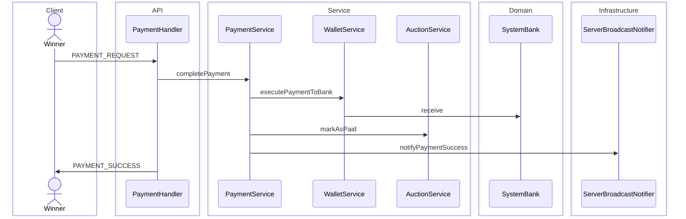

# Payment and Deposit Escrow Sequence Diagram

Winner gửi `PAYMENT_REQUEST` sau khi phiên FINISHED: trừ ví, chuyển tiền vào `SystemBank`, phiên chuyển PAID (`FUNDS_HELD`).  
Cọc winner đã vào bank khi `closeAuction` (tham chiếu chung escrow).

**Mục đích:** Trace thanh toán thắng cuộc và trạng thái giữ tiền.  
**Use case:** Winner thanh toán trong 24h, seller chờ nhận hàng/xác nhận, debug PAYMENT_FAILED.  
**Trong code:** `PaymentHandler` → `PaymentService.completePayment` → `AuctionService.markAsPaid`.

Cọc winner khi đóng phiên: `AuctionService.closeAuction` → `SystemBank.receive(deposit)`.
