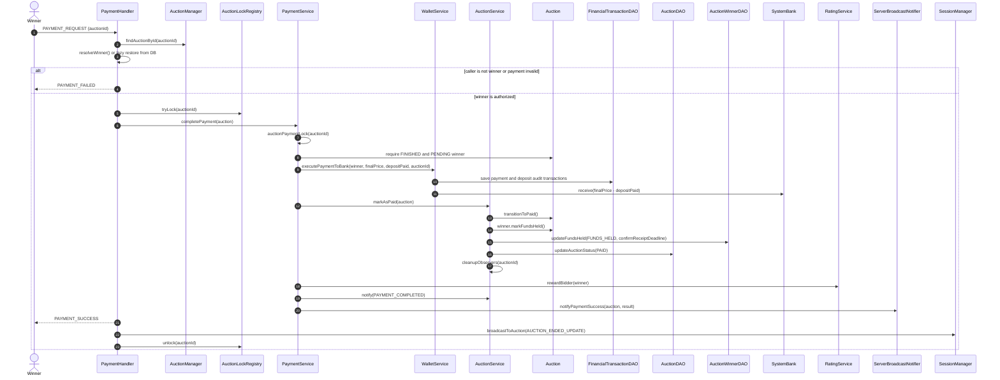

# Payment And Deposit Escrow Sequence Diagram

```mermaid
sequenceDiagram
    autonumber
    actor Winner
    participant Handler as PaymentHandler
    participant Manager as AuctionManager
    participant Lock as AuctionLockRegistry
    participant PaySvc as PaymentService
    participant Wallet as WalletService
    participant AuctionSvc as AuctionService
    participant Auction
    participant TxDAO as FinancialTransactionDAO
    participant AuctionDAO
    participant WinnerDAO as AuctionWinnerDAO
    participant Bank as SystemBank
    participant Rating as RatingService
    participant Broadcast as ServerBroadcastNotifier
    participant Sessions as SessionManager

    Winner->>Handler: PAYMENT_REQUEST {auctionId}
    Handler->>Manager: findAuctionById(auctionId)
    Handler->>Handler: resolveWinner() or lazy restore from DB

    alt caller is not winner or payment invalid
        Handler-->>Winner: PAYMENT_FAILED
    else winner is authorized
        Handler->>Lock: tryLock(auctionId)
        Handler->>PaySvc: completePayment(auction)
        PaySvc->>PaySvc: auctionPaymentLock(auctionId)
        PaySvc->>Auction: require FINISHED and PENDING winner
        PaySvc->>Wallet: executePaymentToBank(winner, finalPrice, depositPaid, auctionId)
        Wallet->>TxDAO: save payment and deposit audit transactions
        Wallet->>Bank: receive(finalPrice - depositPaid)
        PaySvc->>AuctionSvc: markAsPaid(auction)
        AuctionSvc->>Auction: transitionToPaid()
        AuctionSvc->>Auction: winner.markFundsHeld()
        AuctionSvc->>WinnerDAO: updateFundsHeld(FUNDS_HELD, confirmReceiptDeadline)
        AuctionSvc->>AuctionDAO: updateAuctionStatus(PAID)
        AuctionSvc->>AuctionSvc: cleanupObservers(auctionId)
        PaySvc->>Rating: rewardBidder(winner)
        PaySvc->>AuctionSvc: notify(PAYMENT_COMPLETED)
        PaySvc->>Broadcast: notifyPaymentSuccess(auction, result)
        Handler-->>Winner: PAYMENT_SUCCESS
        Handler->>Sessions: broadcastToAuction(AUCTION_ENDED_UPDATE)
        Handler->>Lock: unlock(auctionId)
    end
```
