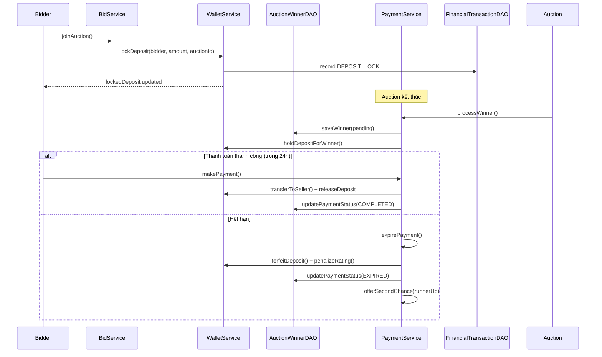

# Payment and Deposit Escrow Sequence Diagram

```mermaid
sequenceDiagram
    participant Bidder
    participant BidService
    participant WalletService
    participant AuctionWinnerDAO
    participant PaymentService
    participant FinancialTransactionDAO

    Bidder->>BidService: joinAuction() 
    BidService->>WalletService: lockDeposit(bidder, amount, auctionId)
    WalletService->>FinancialTransactionDAO: record DEPOSIT_LOCK
    WalletService-->>Bidder: lockedDeposit updated

    Note over PaymentService: Auction kết thúc

    Auction->>PaymentService: processWinner()
    PaymentService->>AuctionWinnerDAO: saveWinner(pending)
    PaymentService->>WalletService: holdDepositForWinner()

    alt Thanh toán thành công (trong 24h)
        Bidder->>PaymentService: makePayment()
        PaymentService->>WalletService: transferToSeller() + releaseDeposit
        PaymentService->>AuctionWinnerDAO: updatePaymentStatus(COMPLETED)
    else Hết hạn
        PaymentService->>PaymentService: expirePayment()
        PaymentService->>WalletService: forfeitDeposit() + penalizeRating()
        PaymentService->>AuctionWinnerDAO: updatePaymentStatus(EXPIRED)
        PaymentService->>PaymentService: offerSecondChance(runnerUp)
    end
```