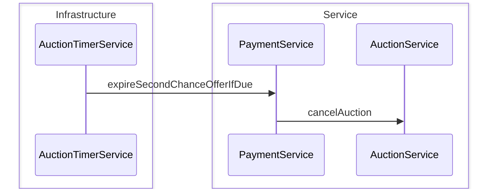

# Payment Expiration Sequence Diagram

Timer xử lý winner không trả đúng hạn: tịch thu cọc, phạt rating, tạo Second Chance hoặc hủy phiên.  
Riêng luồng SCO PENDING quá `deadline` → expire offer → cancel auction.

**Mục đích:** Hiểu hậu quả khi winner/ runner-up không hoàn tất thanh toán.  
**Use case:** Payment expired, email/notify SCO, auction canceled sau SCO hết hạn.  
**Trong code:** `AuctionTimerService.expirePendingWinnerPayments`, `PaymentService.expirePayment`.

## Winner hết hạn thanh toán

```mermaid
sequenceDiagram
    box Infrastructure
        participant TMR as AuctionTimerService
        participant SBN as ServerBroadcastNotifier
    end
    box Service
        participant PS as PaymentService
        participant AS as AuctionService
    end

    TMR->>PS: expirePayment
    opt có runner-up hợp lệ
        PS->>SBN: notifySecondChanceOffered
    else không
        PS->>AS: cancelAuction
    end
    PS->>SBN: notifyPaymentFailed
```

## Second Chance hết hạn


