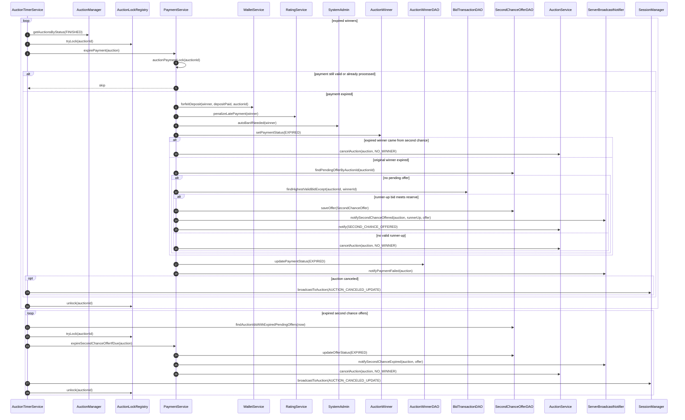

# Payment Expiration Sequence Diagram

```mermaid
sequenceDiagram
    autonumber
    participant Timer as AuctionTimerService
    participant Manager as AuctionManager
    participant Lock as AuctionLockRegistry
    participant PaySvc as PaymentService
    participant Wallet as WalletService
    participant Rating as RatingService
    participant SystemAdmin
    participant Winner as AuctionWinner
    participant WinnerDAO as AuctionWinnerDAO
    participant BidDAO as BidTransactionDAO
    participant OfferDAO as SecondChanceOfferDAO
    participant AuctionSvc as AuctionService
    participant Broadcast as ServerBroadcastNotifier
    participant Sessions as SessionManager

    loop expired winners
        Timer->>Manager: getAuctionsByStatus(FINISHED)
        Timer->>Lock: tryLock(auctionId)
        Timer->>PaySvc: expirePayment(auction)
        PaySvc->>PaySvc: auctionPaymentLock(auctionId)

        alt payment still valid or already processed
            PaySvc-->>Timer: skip
        else payment expired
            PaySvc->>Wallet: forfeitDeposit(winner, depositPaid, auctionId)
            PaySvc->>Rating: penalizeLatePayment(winner)
            PaySvc->>SystemAdmin: autoBanIfNeeded(winner)
            PaySvc->>Winner: setPaymentStatus(EXPIRED)

            alt expired winner came from second chance
                PaySvc->>AuctionSvc: cancelAuction(auction, NO_WINNER)
            else original winner expired
                PaySvc->>OfferDAO: findPendingOfferByAuctionId(auctionId)
                alt no pending offer
                    PaySvc->>BidDAO: findHighestValidBidExcept(auctionId, winnerId)
                    alt runner-up bid meets reserve
                        PaySvc->>OfferDAO: saveOffer(SecondChanceOffer)
                        PaySvc->>Broadcast: notifySecondChanceOffered(auction, runnerUp, offer)
                        PaySvc->>AuctionSvc: notify(SECOND_CHANCE_OFFERED)
                    else no valid runner-up
                        PaySvc->>AuctionSvc: cancelAuction(auction, NO_WINNER)
                    end
                end
            end

            PaySvc->>WinnerDAO: updatePaymentStatus(EXPIRED)
            PaySvc->>Broadcast: notifyPaymentFailed(auction)
            opt auction canceled
                Timer->>Sessions: broadcastToAuction(AUCTION_CANCELED_UPDATE)
            end
        end
        Timer->>Lock: unlock(auctionId)
    end

    loop expired second chance offers
        Timer->>OfferDAO: findAuctionIdsWithExpiredPendingOffers(now)
        Timer->>Lock: tryLock(auctionId)
        Timer->>PaySvc: expireSecondChanceOfferIfDue(auction)
        PaySvc->>OfferDAO: updateOfferStatus(EXPIRED)
        PaySvc->>Broadcast: notifySecondChanceExpired(auction, offer)
        PaySvc->>AuctionSvc: cancelAuction(auction, NO_WINNER)
        Timer->>Sessions: broadcastToAuction(AUCTION_CANCELED_UPDATE)
        Timer->>Lock: unlock(auctionId)
    end
```
