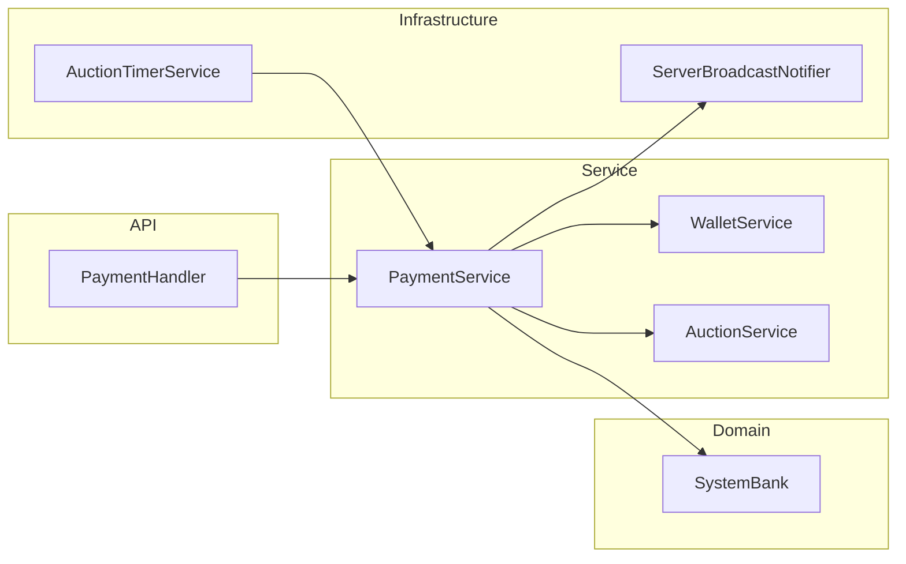

# Payment Subsystem Class Diagram

Thành phần thanh toán sau đấu giá: `PaymentHandler`, `PaymentService`, `WalletService`, `SystemBank`, timer và broadcast.  
Bao gồm escrow, Second Chance, hoàn cọc, giải ngân seller, hoàn tiền quality report.

**Mục đích:** Map nhanh module payment trước khi đọc sequence escrow / expiration / payout.  
**Use case:** Debug thanh toán winner, SCO, ví nội bộ, tiền kẹt ở `SystemBank`.  
**Trong code:** `PaymentHandler`, `PaymentService`, `WalletService`, `com.group13.auction.bank.SystemBank`.

| Sequence | File |
|----------|------|
| Escrow | [PaymentAndDepositEscrowSequenceDiagram.md](./PaymentAndDepositEscrowSequenceDiagram.md) |
| Expiration | [PaymentExpirationSequenceDiagram.md](./PaymentExpirationSequenceDiagram.md) |
| Payout | [SellerPayoutSequenceDiagram.md](./SellerPayoutSequenceDiagram.md) |
