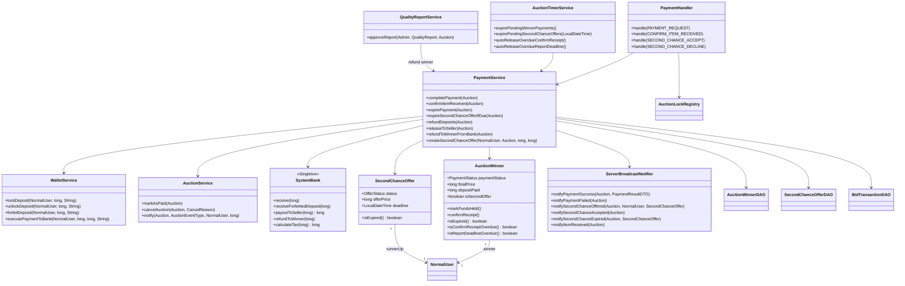

# Payment Subsystem ClassDiagram

```mermaid
classDiagram
    direction TB

    class PaymentHandler {
        +handle(PAYMENT_REQUEST)
        +handle(CONFIRM_ITEM_RECEIVED)
        +handle(SECOND_CHANCE_ACCEPT)
        +handle(SECOND_CHANCE_DECLINE)
    }
    class PaymentService {
        +completePayment(Auction)
        +confirmItemReceived(Auction)
        +expirePayment(Auction)
        +expireSecondChanceOfferIfDue(Auction)
        +refundDeposits(Auction)
        +releaseToSeller(Auction)
        +refundToWinnerFromBank(Auction)
        +createSecondChanceOffer(NormalUser, Auction, long, long)
    }
    class WalletService {
        +lockDeposit(NormalUser, long, String)
        +unlockDeposit(NormalUser, long, String)
        +forfeitDeposit(NormalUser, long, String)
        +executePaymentToBank(NormalUser, long, long, String)
    }
    class AuctionService {
        +markAsPaid(Auction)
        +cancelAuction(Auction, CancelReason)
        +notify(Auction, AuctionEventType, NormalUser, long)
    }
    class SystemBank {
        <<Singleton>>
        +receive(long)
        +receiveForfeittedDeposit(long)
        +payoutToSeller(long) long
        +refundToWinner(long)
        +calculateTax(long) long
    }
    class AuctionWinner {
        +PaymentStatus paymentStatus
        +long finalPrice
        +long depositPaid
        +boolean isSecondOffer
        +markFundsHeld()
        +confirmReceipt()
        +isExpired() boolean
        +isConfirmReceiptOverdue() boolean
        +isReportDeadlineOverdue() boolean
    }
    class SecondChanceOffer {
        +OfferStatus status
        +long offerPrice
        +LocalDateTime deadline
        +isExpired() boolean
    }
    class AuctionTimerService {
        +expirePendingWinnerPayments()
        +expirePendingSecondChanceOffers(LocalDateTime)
        +autoReleaseOverdueConfirmReceipt()
        +autoReleaseOverdueReportDeadline()
    }
    class QualityReportService {
        +approveReport(Admin, QualityReport, Auction)
    }
    class ServerBroadcastNotifier {
        +notifyPaymentSuccess(Auction, PaymentResultDTO)
        +notifyPaymentFailed(Auction)
        +notifySecondChanceOffered(Auction, NormalUser, SecondChanceOffer)
        +notifySecondChanceAccepted(Auction)
        +notifySecondChanceExpired(Auction, SecondChanceOffer)
        +notifyItemReceived(Auction)
    }

    PaymentHandler --> PaymentService
    PaymentHandler --> AuctionLockRegistry
    PaymentService --> WalletService
    PaymentService --> AuctionService
    PaymentService --> SystemBank
    PaymentService --> AuctionWinnerDAO
    PaymentService --> SecondChanceOfferDAO
    PaymentService --> BidTransactionDAO
    PaymentService --> ServerBroadcastNotifier
    PaymentService --> AuctionWinner
    PaymentService --> SecondChanceOffer
    AuctionTimerService --> PaymentService
    QualityReportService --> PaymentService : refund winner
    AuctionWinner "1" --> "1" NormalUser : winner
    SecondChanceOffer "1" --> "1" NormalUser : runnerUp
```
