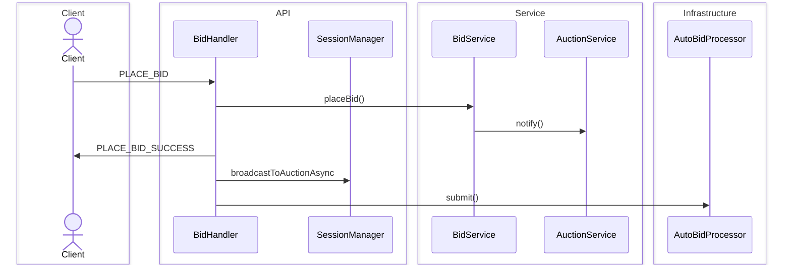
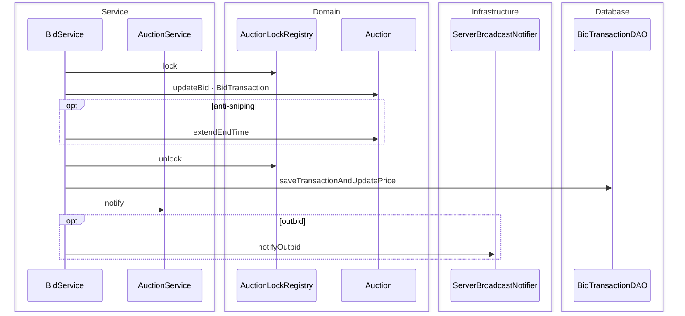

# Place Bid Sequence Diagram

Luồng packet `PLACE_BID`: validate → lock per auction → ghi DB → notify → broadcast WS → kích hoạt auto-bid.  
Lock nằm trong `BidService`, không phải `BidHandler`.

**Mục đích:** Trace end-to-end một lượt đặt giá hợp lệ.  
**Use case:** Bidder đặt giá, anti-sniping gia hạn phiên, outbid, race condition / lost update.  
**Trong code:** `BidHandler.handlePlaceBid` → `BidService.placeBid` → `BidTransactionDAO.saveTransactionAndUpdatePrice`.  
WS bid: [RealtimeBroadcastViaObserverSequenceDiagram.md](./RealtimeBroadcastViaObserverSequenceDiagram.md) (Path B).

## Tổng quan

## Chi tiết — `BidService`

Lock per auction chỉ trong service; persist và notify chạy sau khi unlock.

Auto-bid: [AutoBidSequenceDiagram.md](./AutoBidSequenceDiagram.md)
