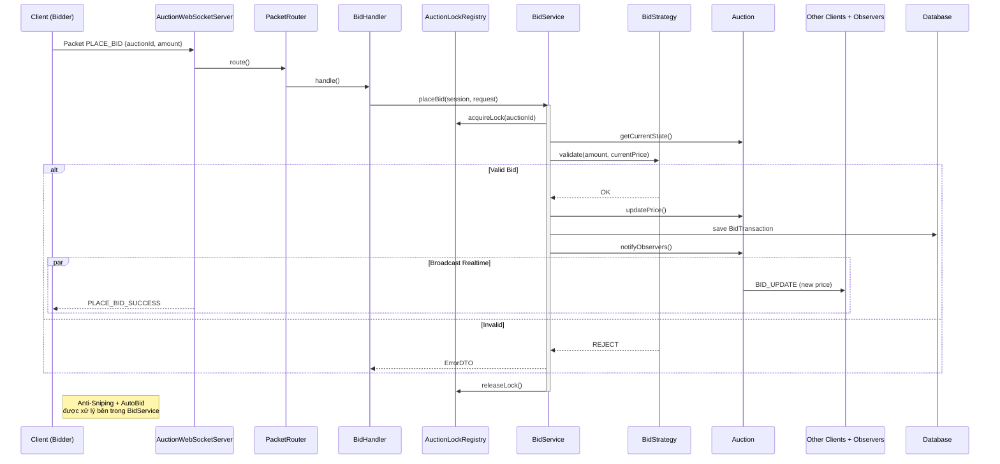

# Sequence Diagram — Luồng Đặt Giá (Place Bid) + Realtime

```mermaid
sequenceDiagram
    participant Bidder as Client (Bidder)
    participant WS as AuctionWebSocketServer
    participant Router as PacketRouter
    participant Handler as BidHandler
    participant Lock as AuctionLockRegistry
    participant BidSvc as BidService
    participant Strategy as BidStrategy
    participant Auction as Auction
    participant Observers as Other Clients + Observers
    participant DB as Database

    Bidder->>WS: Packet PLACE_BID {auctionId, amount}
    WS->>Router: route()
    Router->>Handler: handle()
    Handler->>BidSvc: placeBid(session, request)

    activate BidSvc
    BidSvc->>Lock: acquireLock(auctionId)
    BidSvc->>Auction: getCurrentState()
    BidSvc->>Strategy: validate(amount, currentPrice)
    
    alt Valid Bid
        Strategy-->>BidSvc: OK
        BidSvc->>Auction: updatePrice()
        BidSvc->>DB: save BidTransaction
        BidSvc->>Auction: notifyObservers()
        
        par Broadcast Realtime
            Auction->>Observers: BID_UPDATE (new price)
            WS-->>Bidder: PLACE_BID_SUCCESS
        end
    else Invalid
        Strategy-->>BidSvc: REJECT
        BidSvc-->>Handler: ErrorDTO
    end
    
    BidSvc->>Lock: releaseLock()
    deactivate BidSvc
    
    Note right of Bidder: Anti-Sniping + AutoBid<br/>được xử lý bên trong BidService
```