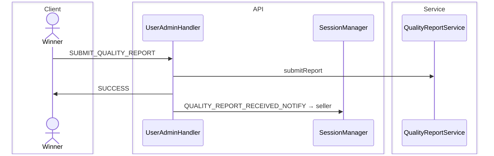
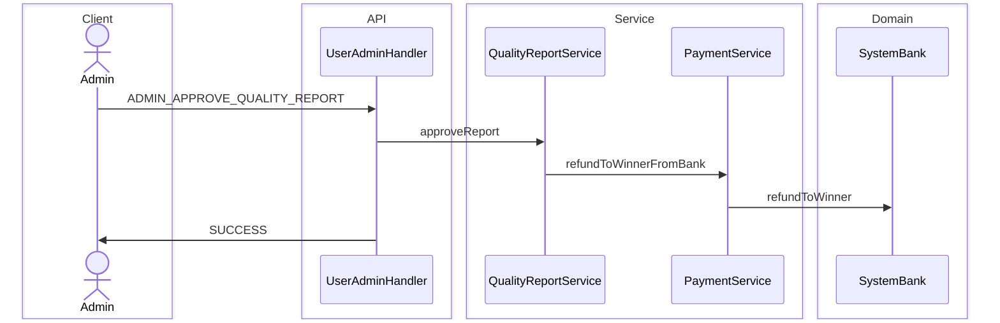

# Quality Report Arbitration Sequence Diagram

Winner gửi báo cáo chất lượng (sau ITEM_RECEIVED); admin approve → hoàn tiền winner từ bank, phạt seller; reject → thông báo từ chối.  
Toàn bộ qua WebSocket `UserAdminHandler`, không gọi service trực tiếp từ client.

**Mục đích:** Trace khiếu nại hàng không đúng mô tả và quyết định admin.  
**Use case:** Submit report có ảnh, admin duyệt/refund, seller bị trừ rating/ban.  
**Trong code:** `SUBMIT_QUALITY_REPORT`, `ADMIN_APPROVE_QUALITY_REPORT`, `QualityReportService`.

## Submit

## Admin approve

