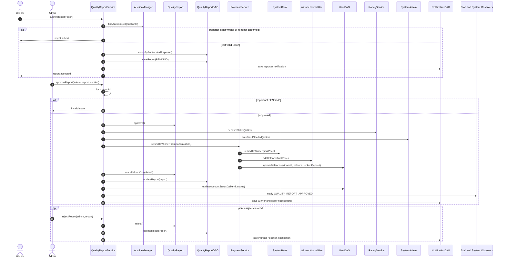

# Quality Report Arbitration Sequence Diagram

```mermaid
sequenceDiagram
    autonumber
    actor Winner
    actor Admin
    participant ReportSvc as QualityReportService
    participant Manager as AuctionManager
    participant Report as QualityReport
    participant ReportDAO as QualityReportDAO
    participant PaySvc as PaymentService
    participant Bank as SystemBank
    participant WinnerUser as Winner NormalUser
    participant UserDAO
    participant Rating as RatingService
    participant SystemAdmin
    participant NotifyDAO as NotificationDAO
    participant Staff as Staff and System Observers

    Winner->>ReportSvc: submitReport(report)
    ReportSvc->>Manager: findAuctionById(auctionId)
    alt reporter is not winner or item not confirmed
        ReportSvc-->>Winner: reject submit
    else first valid report
        ReportSvc->>ReportDAO: existsByAuctionAndReporter()
        ReportSvc->>ReportDAO: saveReport(PENDING)
        ReportSvc->>NotifyDAO: save reporter notification
        ReportSvc-->>Winner: report accepted
    end

    Admin->>ReportSvc: approveReport(admin, report, auction)
    ReportSvc->>ReportSvc: lock reportId
    alt report not PENDING
        ReportSvc-->>Admin: invalid state
    else approved
        ReportSvc->>Report: approve()
        ReportSvc->>Rating: penalizeSeller(seller)
        ReportSvc->>SystemAdmin: autoBanIfNeeded(seller)
        ReportSvc->>PaySvc: refundToWinnerFromBank(auction)
        PaySvc->>Bank: refundToWinner(finalPrice)
        PaySvc->>WinnerUser: addBalance(finalPrice)
        PaySvc->>UserDAO: updateBalances(winnerId, balance, lockedDeposit)
        ReportSvc->>Report: markRefundCompleted()
        ReportSvc->>ReportDAO: updateReport(report)
        ReportSvc->>UserDAO: updateAccountStatus(sellerId, status)
        ReportSvc->>Staff: notify QUALITY_REPORT_APPROVED
        ReportSvc->>NotifyDAO: save winner and seller notifications
    end

    opt admin rejects instead
        Admin->>ReportSvc: rejectReport(admin, report)
        ReportSvc->>Report: reject()
        ReportSvc->>ReportDAO: updateReport(report)
        ReportSvc->>NotifyDAO: save winner rejection notification
    end
```
