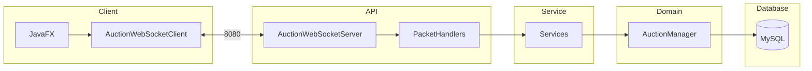

<div align="center">

# OmniBid - Hệ thống Đấu giá Trực tuyến

**Nền tảng đấu giá desktop thời gian thực, xây dựng bằng Java theo mô hình Client-Server.**  
Xử lý đặt giá đồng thời an toàn, broadcast giá tức thì qua WebSocket, và tự động hoá toàn bộ quy trình hậu mãi từ escrow đến hoàn tiền.

---

[](https://github.com/vuxgiakhanh-source/online-auction-system/actions/workflows/maven.yml)


</div>

---

## 🧾 Mục lục

* [Giới thiệu](#-giới-thiệu)
* [Demo](#-demo)
* [Đặc điểm kĩ thuật nổi bật](#-đặc-điểm-kĩ-thuật-nổi-bật)
* [Chức năng hệ thống](#-chức-năng-hệ-thống)
    * [Chức năng cốt lõi](#chức-năng-cốt-lõi)
    * [Chức năng nâng cao](#chức-năng-nâng-cao)
* [Kiến trúc hệ thống](#-kiến-trúc-hệ-thống)
    * [Kiến trúc tổng quan](#kiến-trúc-tổng-quan)
    * [Kiến trúc chatbot](#-kiến-trúc-chatbot)
    * [Cấu trúc project](#-cấu-trúc-project)
    * [Design Patterns áp dụng](#design-patterns-áp-dụng)
* [Tech Stack](#-tech-stack)
* [Hướng dẫn cài đặt](#-hướng-dẫn-cài-đặt)
  * [Yêu cầu](#yêu-cầu)
  * [Các bước cài đặt](#các-bước-cài-đặt)
  * [Vị trí file .jar](#vị-trí-file-jar)
  * [Troubleshooting](#troubleshooting)
* [Testing](#-testing)
* [Công nghệ & Công cụ sử dụng](#-công-nghệ--công-cụ-sử-dụng)
* [Đội ngũ & Phân công nhiệm vụ (Team Section & Project Roadmap))](#-đội-ngũ--phân-công-nhiệm-vụ-team-section--project-roadmap)
  * [Đội ngũ](#-đội-ngũ)
  * [Tổng quan Timeline](#-tổng-quan-timeline)
* [Liên hệ](#-liên-hệ)
* [License](#-license)

___

## 🚀 Giới thiệu

**OmniBid** là ứng dụng đấu giá **desktop** (Java Client–Server): Seller đăng sản phẩm, Bidder đặt giá theo thời gian thực; Admin quản trị phiên, người dùng và khiếu nại.

Hệ thống tập trung **đấu giá đồng thời an toàn**, **cập nhật giá qua WebSocket**, và **hậu mãi** (escrow, Quality Report, hoàn tiền, Second Chance Offer).

**Phạm vi:** ứng dụng JavaFX trên máy người dùng, server WebSocket + MySQL; ba vai trò Bidder / Seller / Admin; không bao gồm thanh toán ngân hàng thật hay triển khai mobile/web public.


---

## 🎬 Demo

|                    | Link                           |
|--------------------|--------------------------------|
| 📄 **Báo cáo PDF** | _[Báo cáo](./BAOCAOBTL13.pdf)_ |
| 🎥 **Video Demo**  | https://drive.google.com/file/d/169bXlAm_PhxkFmzcMGVyu3k8yBPOSoyq/view?usp=sharing               |

---

## 👷 Chức năng hệ thống

### Use Case tổng quát
  > Tham khảo __UseCase Diagram__ [tại đây](./UseCaseDiagram.md)

### Chức năng cốt lõi
* __Quản lý tài khoản và Phân quyền__: Hệ thống phân quyền chi tiết cho 03 nhóm đối tượng: Bidder (Người mua), Seller (Người bán) và Admin (Quản trị viên), đảm bảo tính bảo mật và đúng vai trò trong mọi tác vụ.


* __Phiên đấu giá linh hoạt (Smart Scheduler)__: Điều phối trạng thái phiên đấu giá hoàn toàn tự động theo thời gian thực (từ __OPEN → RUNNING → FINISHED__) nhờ __Scheduler__. Hệ thống đảm bảo tính chính xác tuyệt đối trong việc đóng/mở thầu.  
  > Tham khảo __Auction Life Sequence Diagram__ [tại đây](./AuctionLifecycleSequenceDiagram.md)  


* __Đấu giá Realtime & Thông báo__: Cập nhật giá qua WebSocket (`BidHandler` → `SessionManager`); inbox và lifecycle events qua `AuctionService.notify` + `ServerBroadcastNotifier`.
  > Tham khảo __Realtime Broadcast via Observer__ [tại đây](./RealtimeBroadcastViaObserverSequenceDiagram.md)  

* __Hệ thống Tài chính & Hậu mãi__: Tích hợp ví nội bộ xử lý thanh toán tự động khi kết thúc phiên (PAID). Cung cấp cơ chế __Báo cáo chất lượng (Quality Report)__ và __Hoàn tiền (Refund)__ tự động nếu sản phẩm không đúng cam kết, bảo vệ tối đa quyền lợi người mua.
  > Tham khảo __Payment and Deposit Escrow__ [tại đây](./PaymentAndDepositEscrowSequenceDiagram.md), __Payment Expiration / Second Chance__ [tại đây](./PaymentExpirationSequenceDiagram.md), và __Seller Payout__ [tại đây](./SellerPayoutSequenceDiagram.md)

### Chức năng nâng cao
* __Auto-Bidding (Đấu giá tự động)__: Cho phép người dùng thiết lập mức giá tối đa và bước giá để hệ thống tự động trả giá thay thế khi có đối thủ mới mà không cần trực tuyến liên tục.
  > Tham khảo __Auto-Bid Engine Sequence Diagram__ [tại đây](./AutoBidSequenceDiagram.md)


* __Thuật toán Anti-Sniping__: Tự động gia hạn thời gian kết thúc nếu có lượt đặt giá phát sinh vào những giây cuối cùng, đảm bảo tính công bằng cho người dùng.


* __Trực quan hóa dữ liệu__: Hiển thị biểu đồ đường (Line Chart) biểu diễn lịch sử đấu giá theo thời gian thực, giúp người dùng phân tích xu hướng và đưa ra quyết định đặt giá chính xác.

* __Đề nghị Cơ hội Thứ hai (Second Chance Offer)__: Khi người thắng cuộc không thực hiện thanh toán đúng hạn, hệ thống sẽ tự động (nhờ __Scheduler__) gửi đề nghị cho người xếp thứ hai với mức giá cao nhất tiếp theo.


* __Thanh toán Ký quỹ & Xử lý Khiếu nại__: Áp dụng cơ chế Escrow (giữ tiền qua SystemBank) để bảo vệ người mua. Sau khi nhận hàng, người mua có thể gửi **Báo cáo chất lượng (Quality Report)**. Admin duyệt báo cáo hợp lệ sẽ tiến hành hoàn tiền tự động cho người mua và trừ tiền người bán.
  > Tham khảo __Quality Report Arbitration Sequence Diagram__ [tại đây](./QualityReportArbitrationSequenceDiagram.md)

* __Hệ thống Đánh giá Người dùng (Rating Service)__: Tự động theo dõi và cập nhật điểm đánh giá của người dùng dựa trên lịch sử giao dịch. Người dùng vi phạm nhiều lần (không giao hàng, khiếu nại không hợp lý...) sẽ bị tạm ngưng hoặc khóa tài khoản theo quy định.


* __Hỗ trợ khách hàng thông minh (Smart Chatbot)__: Tích hợp trợ lý ảo ngay trên giao diện JavaFX, hỗ trợ giải đáp thắc mắc về quy trình đấu giá, chính sách thanh toán và tìm kiếm phiên đấu giá nhanh thông qua từ khóa.

  * __Tra cứu FAQ__: Trả về câu trả lời tức thì cho các câu hỏi thường gặp.

  * __Tìm kiếm thông minh__: Sử dụng thuật toán tính điểm liên quan (Relevance Scoring) để gợi ý thông tin chính xác nhất.

---

## ✨ Đặc điểm kĩ thuật nổi bật
Hệ thống được phát triển với các tiêu chuẩn kỹ thuật:
* __Real-time Engine__: Bid realtime qua `BidHandler` → `SessionManager`; domain events qua `AuctionService.notify` (xem [RealtimeBroadcastViaObserverSequenceDiagram.md](./RealtimeBroadcastViaObserverSequenceDiagram.md)).
  > Add ảnh mô tả luồng hoạt động của 1 Bidder (Bidder → Server → BroadCast tới các Bidders khác) (GIF)


* __Concurrency Control__: Giải quyết triệt để các vấn đề Lost Update và Race Condition trong kịch bản nhiều người cùng đặt giá tại một mili giây.


* __Cấu trúc hướng đối tượng (OOP)__: Áp dụng chặt chẽ 4 nguyên lý OOP __(Đóng gói, Kế thừa, Đa hình, Trừu tượng)__ cùng các mẫu thiết kế __Factory Method, Singleton, Strategy, Observer và State__ để quản lý logic nghiệp vụ phức tạp.


* __Kiến trúc MVC Phân tầng:__ Tách biệt hoàn toàn giao diện (Client side) và logic xử lý dữ liệu (Server side) qua ___mô hình Client-Server___. Tách biệt rõ ràng các tầng (Network, Handler, Service, Domain, DAO, Observer).
  > Add ảnh MVC Diagram

---

## 🏗️ Kiến trúc hệ thống
Hệ thống theo __Layered Client-Server__: JavaFX client ↔ WebSocket server ↔ MySQL.

### 🏛️ Kiến trúc tổng quan


> Bid WS: `BidHandler` → `SessionManager` · Domain notify: `AuctionService.notify` → [RealtimeBroadcastViaObserverSequenceDiagram.md](./RealtimeBroadcastViaObserverSequenceDiagram.md)  
> Diagrams: [ClassDiagram.md](./ClassDiagram.md)

### 🤖 Kiến trúc chatbot

Chatbot được xây dựng theo mô hình hướng sự kiện (Event-Driven), tách biệt hoàn toàn giữa tầng điều phối (Handler) và tầng cung cấp dữ liệu (Provider).
* __PacketRouter__: Giải mã và điều phối các gói tin CHATBOT_ASK hoặc CHATBOT_GET_FAQ_LIST.
* __ChatbotProvider__ (Singleton): Đảm bảo hiệu năng bằng cách nạp dữ liệu từ faq_data.json một lần duy nhất vào bộ nhớ và hỗ trợ truy vấn $O(1)$ qua HashMap.

  > Tham khảo __Chatbot diagram__ [tại đây](./Chatbot.md)

### 📂 Cấu trúc project

Project được tổ chức theo kiến trúc **Multi-module Maven**:

```text
online-auction-system/
│
├── auction-common/                  # Module dùng chung (Client & Server)
│   └── src/main/java/.../common/
│       ├── dto/                     # DTO (auth, bid, auction, payment, admin, report...)
│       ├── protocol/                # Packet, PacketType, PacketCodec (Gson-based)
│       └── messages/                # RealtimeAccessMessages và message constants
│
├── auction-server/                  # Module Server
│   └── src/main/java/.../auction/
│       ├── bank/                    # SystemBank
│       ├── chatbot/                 # handler/, provider/, model/ (FAQ, faq_data.json)
│       ├── model/                   # entity, user, item, auction (State), bid
│       ├── service/                 # Business services + iservice/, scheduler/
│       ├── dao/                     # AuctionDAO, UserDAO, ItemDAO, ...
│       ├── network/server/          # WebSocket, PacketRouter, handlers, session, image/
│       ├── observer/                # AuctionObserver → BidderObserver, SellerObserver, …
│       ├── strategy/                # BidStrategy, AutoBidStrategy, AuctionLockRegistry, ...
│       └── manager/                 # AuctionManager (Singleton)
│
└── auction-client/                  # Module Client (JavaFX 21)
    └── src/main/java/.../auction/
        ├── ui/                      # Controllers & FXML views
        ├── viewmodel/               # ViewModels (auction, admin, payment, chatbot, ...)
        ├── mapper/                  # DTO ↔ ViewModel mappers
        ├── service/                 # Client-side services (auth, bid, wallet, ...)
        ├── network/client/          # AuctionWebSocketClient, ClientPacketDispatcher, Session
        ├── network/http/            # ImageUploadService (port 8081)
        ├── config/                  # SocketConfig, ImageConfig, ViewPath, ...
        └── core/                    # navigation/, state/
```

  > Tham khảo Class Diagram [tại đây](./ClassDiagram.md)

### Design Patterns áp dụng:
| Pattern            | Implementation                                                                              | Mục đích hệ thống |
|--------------------|---------------------------------------------------------------------------------------------|----------------------------------|
| **State**          | `AuctionState` → `OpenState`, `RunningState`, `FinishedState`, `PaidState`, `CanceledState` | Quản lý logic chuyển đổi trạng thái phiên đấu giá (Mở → Chạy → Kết thúc) một cách tự động và rõ ràng. |
| **Observer**       | `AuctionObserver` → `BidderObserver`, `SellerObserver`, …                                 | Domain events & inbox; bid WebSocket riêng qua `BidHandler` (xem RealtimeBroadcastViaObserverSequenceDiagram). |
| **Strategy**       | `BidStrategy`                                                                               | Linh hoạt giữa các chế độ đặt giá thủ công và Auto-Bidding. |
| **Factory Method** | `ItemFactory`, `UserFactory`                                                                | Chuẩn hóa việc tạo các loại Item (Electronics, Art, Vehicle...) và User. |
| **Singleton**      | `AuctionManager`, `DatabaseConnection`, `ChatbotProvider`                                    | Đảm bảo chỉ tồn tại duy nhất một instance cho các thành phần quản lý toàn cục. |

---


## ⚙️ Tech Stack

**Backend (Server)**
- Java 17, Maven Multi-module (`auction-common` / `auction-server` / `auction-client`)
- Java-WebSocket — giao tiếp WebSocket
- Gson — JSON serialization / PacketCodec
- MySQL 8.0 + JDBC — persistence layer
- Logback — structured logging (3 file: business / dao / error)
- JUnit 5 + Mockito + Testcontainers — testing pyramid

**Frontend (Client)**
- JavaFX 21 — desktop UI
- MVC pattern: Controllers ↔ ViewModels / Mappers ↔ ClientPacketDispatcher ↔ AuctionWebSocketClient

**DevOps**
- Docker + Docker Compose (multi-stage Dockerfile, image push GHCR qua GitHub Actions)
- GitHub Actions — build, test (`mvn verify`), Docker publish khi push `main`
- Qodana — static code analysis

---

## 💡 Hướng dẫn cài đặt

### Yêu cầu :
| Công cụ        | Phiên bản                    | Kiểm tra                 |
|----------------|------------------------------|--------------------------|
| JDK            | 17 LTS (khuyên dùng Temurin) | `java -version`          |
| Apache Maven   | 3.9+                         | `mvn -version`           |
| Docker Compose | Khuyến nghị                  | `docker compose version` |
| MySQL          | 8.0+ nếu không dùng Docker   | `mysql --version`        |

⚠️ **Quan trọng:** server cần MySQL chạy trước. Cách đơn giản nhất là dùng Docker Compose để chạy MySQL.

### Các bước cài đặt 
#### 1. Clone repository

```bash
git clone https://github.com/vuxgiakhanh-source/online-auction-system.git
cd online-auction-system
```

#### 2. Tạo Database

**Cách khuyến nghị: chạy MySQL bằng Docker**

```bash
docker compose up db -d
```

Compose sẽ chạy MySQL ở `localhost:3307` và tự import `schema.sql` + `seed.sql` khi volume DB mới được tạo.

Tài khoản mặc định khớp với `data.properties`:
- database: `auction_db`
- username: `auction_user`
- password: `auction_pass`

**Nếu dùng MySQL local thay Docker**

```bash
mysql -u root -p -e "DROP DATABASE IF EXISTS auction_db; CREATE DATABASE auction_db;"
mysql -u root -p auction_db < auction-server/src/main/resources/database/schema.sql
mysql -u root -p auction_db < auction-server/src/main/resources/database/seed.sql
```

#### 3. Cấu hình kết nối

Nếu dùng Docker ở bước 2 thì không cần sửa. File mặc định `auction-server/src/main/resources/data.properties` đã trỏ tới `localhost:3307`:

```properties
db.url=jdbc:mysql://localhost:3307/auction_db?useSSL=false&allowPublicKeyRetrieval=true&serverTimezone=UTC
db.username=auction_user
db.password=auction_pass
```

Nếu dùng MySQL local ở `localhost:3306`, sửa lại:

```properties
db.url=jdbc:mysql://localhost:3306/auction_db?useSSL=false&allowPublicKeyRetrieval=true&serverTimezone=UTC
db.username=root
db.password=your_password
```

> 🔒 **Bảo mật:** Không commit mật khẩu thật lên repository.

#### 4. Build toàn bộ project

```bash
# Build nhanh để chạy app và install các module vào Maven local
mvn clean install -DskipTests
```

> Checkstyle dùng **Google Java Style** qua `<configLocation>google_checks.xml</configLocation>` trong `pom.xml` — file này do plugin/checkstyle resolve từ dependency, **không cần** copy `google_checks.xml` vào repo. Module `auction-client` mặc định `checkstyle.skip=true`. Trên PowerShell, nếu cần tham số `-D...` có dấu chấm thì bọc trong dấu nháy.

#### 5. Khởi động Server

```bash
java -jar auction-server/target/auction-server-1.0-SNAPSHOT.jar
```

Server mặc định chạy:
- WebSocket: `ws://localhost:8080/auction`
- Image upload HTTP server: `http://localhost:8081`

Có thể đổi port bằng biến môi trường:

```bash
# PowerShell
$env:SERVER_PORT="8080"
$env:IMAGE_SERVER_PORT="8081"
java -jar auction-server/target/auction-server-1.0-SNAPSHOT.jar
```

#### 6. Khởi động Client _(terminal mới)_

```bash
mvn -f auction-client/pom.xml javafx:run
```

> **Lưu ý:** Client mặc định kết nối đến `localhost:8080`. Nếu server chạy trên host/port khác:

```bash
mvn -f auction-client/pom.xml javafx:run "-Dauction.server.host=localhost" "-Dauction.server.port=8080"
```

---

### Vị trí file JAR

Sau khi build xong (`mvn clean install -DskipTests`), các file JAR nằm tại:

| Module     | Đường dẫn                                                                                    |
|------------|----------------------------------------------------------------------------------------------|
| **Server** | `auction-server/target/auction-server-1.0-SNAPSHOT.jar`                                      |
| **Client** | `auction-client/target/auction-client-1.0-SNAPSHOT.jar`                                      |
| **Common** | `auction-common/target/auction-common-1.0-SNAPSHOT.jar` _(shared lib, không chạy trực tiếp)_ |

Chạy trực tiếp từ JAR (không cần Maven):

```bash
# Bước 1 — Server trước
java -jar auction-server/target/auction-server-1.0-SNAPSHOT.jar

# Bước 2 — Client sau (terminal mới)
java -jar auction-client/target/auction-client-1.0-SNAPSHOT.jar
```

Nếu JAR client báo thiếu JavaFX runtime, chạy client bằng Maven (`mvn -f auction-client/pom.xml javafx:run`) là cách ổn định hơn vì Maven tự tải JavaFX dependencies.

**Chạy full stack bằng Docker Compose**

```bash
# Tùy chọn: cp env.example .env và chỉnh mật khẩu DB
docker compose up --build
```

Compose khởi động MySQL + `auction-server` (WebSocket **8080**). Image upload HTTP (**8081**) chỉ có khi chạy server bằng JAR/Maven trên host — không được map trong `docker-compose.yml` hiện tại.

---

### Troubleshooting

| Lỗi                                 | Nguyên nhân                    | Cách xử lý |
|-------------------------------------|--------------------------------|-------------|
| `Communications link failure`       | MySQL chưa chạy hoặc sai port  | Chạy `docker compose up db -d`, kiểm tra `data.properties` trỏ `localhost:3307` |
| `Access denied for user`            | Sai username/password DB       | Dùng `auction_user` / `auction_pass` với Docker, hoặc sửa `data.properties` theo MySQL local |
| `Address already in use: 8080`      | Port WebSocket bị chiếm        | Đổi `SERVER_PORT` khi chạy server |
| `Address already in use: 8081`      | Port image server bị chiếm     | Đổi `IMAGE_SERVER_PORT` khi chạy server |
| `JavaFX runtime components missing` | Chạy client JAR thiếu JavaFX   | Chạy `mvn -f auction-client/pom.xml javafx:run` |
| `BUILD FAILURE` do Checkstyle       | Vi phạm Google Java Style      | Sửa code theo báo lỗi, hoặc `"-Dcheckstyle.skip"` khi build nhanh local |
| `BUILD FAILURE` do tests            | Test cần DB/Docker             | Dùng `-DskipTests` để chạy app nhanh, hoặc setup Docker trước khi test |

---

## 🧪 Testing

Project áp dụng __testing pyramid__ trên cả ba module: `auction-server` (unit, integration, concurrency, load), `auction-client` (ViewModel / mapper / validation), và `auction-common` (DTO / protocol).

__Thống kê (đếm `@Test` trong repo)__

| Module / loại | Files | `@Test` methods | Ghi chú |
|---------------|-------|-----------------|---------|
| **auction-server** | ~66 | ~680 | Gồm unit, integration, concurrency, load (xem bảng dưới) |
| **auction-client** | 59 | ~357 | ViewModel, mapper, validation phía client |
| **auction-common** | 15 | ~161 | DTO, `PacketCodec`, protocol |
| **TỔNG CỘNG** | **~140** | **~1,198** | |

_Phân rã trong `auction-server` (không cộng thêm vào tổng):_

| Thư mục | Files | `@Test` | Đặc điểm |
|---------|-------|---------|----------|
| `unit/` | 42 | ~545 | JUnit 5 + Mockito |
| `integration/` + `*IT` | ~14 | ~130 | Testcontainers / MySQL, `@RequiresDocker` |
| `concurrency/` | 17 | ~86 | Race condition, `ExecutorService` |
| `load/` | 10 | ~85 | `*LoadIT`, `*LoadTest` |

```bash
# Chạy toàn bộ tests (cần Docker cho integration)
mvn clean verify

# Chỉ server module
cd auction-server && mvn test

# Chỉ client module
cd auction-client && mvn test
```

### Phân bổ test server theo tầng (tiêu biểu)

| Tầng | Test classes | Scenarios tiêu biểu |
|------|--------------|---------------------|
| **Domain / State Machine** | `AuctionTest`, `AuctionStateMachineTest`, `AuctionWinnerTest`, `SecondChanceOfferTest` | State transitions, winner determination |
| **Concurrency / lock** | `AuctionLockRegistryTest`, `AuctionLockRegistryConcurrencyTest`, `BidRaceConditionTest` | Per-auction locking, race prevention |
| **Strategy** | `AutoBidStrategyTest`, `BidStrategyContractTest`, `AutoBidProcessorTest` | Manual vs auto-bid, contract trên `BidStrategy` |
| **Observer** | `AuctionObserverContractTest`, `ObserverNotificationSmokeTest`, `ObserverConcurrencyTest` | Notification propagation, đa luồng |
| **Service** | `BidServiceTest`, `PaymentServiceTest`, `AuctionServiceTest`, `QualityReportServiceTest`, … | Business logic, payment flows |
| **Factory / singleton** | `UserFactoryTest`, `ItemFactoryTest`, `AuctionManagerTest`, `SystemBankTest` | Object creation, single instance |

---

## 👥 Đội ngũ & Phân công nhiệm vụ (Team Section & Project Roadmap)

### 🧠 Đội ngũ
|                                            Thành viên                                               | Vai trò                                                      | Nhiệm vụ chính                                                                                                 |                Tiến độ                |   Trạng thái   |
|:---------------------------------------------------------------------------------------------------:|:-------------------------------------------------------------|:---------------------------------------------------------------------------------------------------------------|:-------------------------------------:|:--------------:|
|             <br/>**Hồ Huyền Chi**             | **Trưởng nhóm** <br/> OOP Design <br/> Testing               | · Core auction logic <br/> · Code review & refactor <br/> · Tài liệu <br/> · Unit tests                        |  |     ✅ DONE     |
| <br/>**Vũ Gia Khánh** | **Thành viên** <br/> Concurrency <br/> Testing <br/> Network | · Network & concurrency <br/> · Advanced features <br/> · Integration tests <br/> · Concurrency & Load tests   |  |     ✅ DONE     |
|       <br/>**Bạch Quốc Thịnh**       | **Thành viên** <br/> Backend <br/> Database                  | · Database design <br/> · DAO layer <br/> · Anti-Sniping <br/> · Scheduler Building <br/> · Notification Layer |  |     ✅ DONE     |
|     <br/>**Trần Thảo Nhi**     | **Thành viên** <br/> Frontend                                | · Toàn bộ JavaFX UI <br/> · Client module <br/> · Tài liệu                                                     |  |     ✅ DONE     |


### 📅 Tổng quan Timeline

```
Tuần 1         Tuần 2–3          Tuần 4–5              Tuần 6         Tuần 7           Tuần 8
[Phase 1] ──▶ [Phase 2] ──────▶ [Phase 3] ─────────▶ [Phase 4] ──▶ [Phase 5] ─────▶ [Phase 6]
Foundation    Core Logic        Advanced Features      Testing       Integration     Polish & Deploy
24/3–30/3     31/3–13/4         14/4–27/4              28/4–11/5     12/5–18/5       19/5–25/5
```
 
⭐ [Chi tiết phase 1 và contributors](./CONTRIBUTORS.md#-phase-1--project-foundation--architecture-design)  
⭐ [Chi tết phase 2 và contributors](./CONTRIBUTORS.md#-phase-2--core-domain--data-layer-implementation)  
⭐ [Chi tiết phase 3 và contributors](./CONTRIBUTORS.md#-phase-3--advanced-features--business-logic-completion)  
⭐ [Chi tiết phase 4 và contributors](./CONTRIBUTORS.md#-phase-4--testing--quality-assurance)  
⭐ [Chi tiết phase 5 và contributors](./CONTRIBUTORS.md#-phase-5--integration-cicd--containerization)  
⭐ [Chi tiết phase 6 và contributors](./CONTRIBUTORS.md#-phase-6--documentation-polish--demo-preparation)

---

## 📞 Liên hệ

| Thành viên      | Trách nhiệm               | GitHub                                                          | Email                    |
|-----------------|---------------------------|-----------------------------------------------------------------|--------------------------|
| Hồ Huyền Chi    | Core Logic <br/> OOP      | [@hchyy](https://github.com/hchyy)                              | chidinhhoi1709@gmail.com |
| Vũ Gia Khánh    | Concurrency <br/> Testing | [@vuxgiakhanh-source](https://github.com/vuxgiakhanh-source)    | vuxgiakhanh@gmail.com    |
| Bạch Quốc Thịnh | Database <br/> Backend    | [@thebrosaythree](https://github.com/thebrosaythree)            | iamven56@gmail.com       |
| Trần Thảo Nhi   | Frontend                  | [@bingbongg](https://github.com/bingbongg)                      | tthaonhi0127@gmail.com   |

---

## 📄 License

__MIT © 2026 Group 13 - OmniBid__

