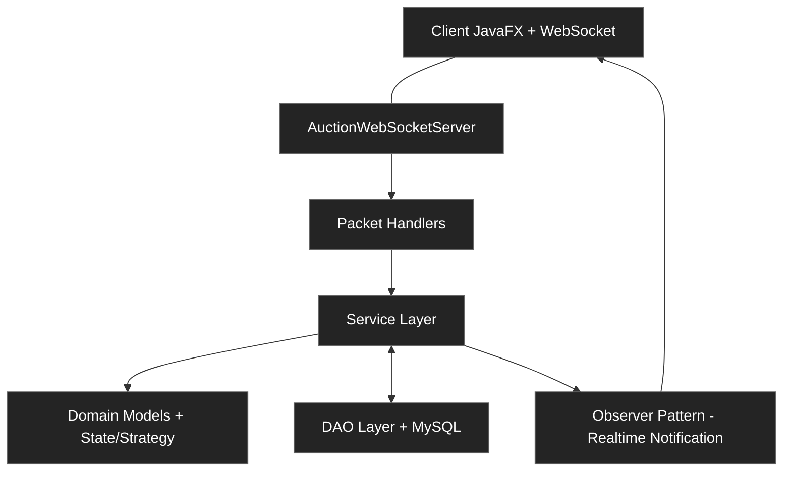
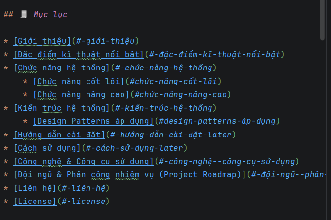

# 💸 OminiBid - Hệ thống đấu giá Online 💸

## 🧾 Mục lục

* [Giới thiệu](#-giới-thiệu)
* [Đặc điểm kĩ thuật nổi bật](#-đặc-điểm-kĩ-thuật-nổi-bật)
* [Chức năng hệ thống](#-chức-năng-hệ-thống)
    * [Chức năng cốt lõi](#chức-năng-cốt-lõi)
    * [Chức năng nâng cao](#chức-năng-nâng-cao)
* [Kiến trúc hệ thống](#-kiến-trúc-hệ-thống)
    * [Design Patterns áp dụng](#design-patterns-áp-dụng)
* [Hướng dẫn cài đặt](#-hướng-dẫn-cài-đặt-later)
* [Cách sử dụng](#-cách-sử-dụng-later)
* [Công nghệ & Công cụ sử dụng](#-công-nghệ--công-cụ-sử-dụng)
* [Đội ngũ & Phân công nhiệm vụ (Project Roadmap)](#-đội-ngũ--phân-công-nhiệm-vụ-project-roadmap)
* [Liên hệ](#-liên-hệ)
* [License](#-license)

___

## 🚀 Giới thiệu
**OmniBid** là một nền tảng đấu giá trực tuyến mạnh mẽ và hiện đại, được xây dựng để mang đến một môi trường giao dịch **minh bạch, công bằng và đầy kịch tính**.

Hệ thống cho phép người bán (Seller) dễ dàng đăng tải các sản phẩm đa dạng, trong khi người mua (Bidder) có thể tham gia đấu thầu cạnh tranh gay gắt để sở hữu món đồ với mức giá phù hợp nhất thông qua cơ chế thị trường thực thụ.

Không dừng lại ở việc đơn thuần kết nối người mua và người bán, **OmniBid** tập trung giải quyết triệt để những bài toán khó của hệ thống phân tán: xử lý **đấu giá đồng thời** an toàn, ngăn chặn Race Condition, **cập nhật giá realtime** cho hàng trăm người dùng cùng lúc thông qua WebSocket, cùng với **quy trình hậu mãi** chuyên nghiệp (escrow payment, Quality Report, hoàn tiền tự động, Second Chance Offer…).

Dự án được phát triển bằng Java theo mô hình Client-Server, áp dụng sâu các nguyên lý **OOP** cùng nhiều **Design Patterns** quan trọng (State, Observer, Strategy, Factory, Singleton). Nhờ đó, **OmniBid** không chỉ hoạt động mượt mà mà còn có kiến trúc sạch, dễ mở rộng và bảo trì.
> Add ảnh demo mô phỏng ứng dụng hoạt động (ghép 2-3 màn hình (Login, 
> Auction List, Bidding Detail) vào một khung ảnh)

---

## ✨ Đặc điểm kĩ thuật nổi bật
Hệ thống được phát triển với các tiêu chuẩn kỹ thuật:
* __Real-time Engine__: Sử dụng mô hình __Observer Pattern__ kết hợp với 
__Socket__ để cập nhật biến động giá ngay lập tức tới tất cả các client 
mà không cần tải lại trang.
> Add ảnh mô tả luồng hoạt động của 1 Bidder (Bidder → Server → BroadCast
> tới các Bidders khác) (GIF)


* __Concurrency Control__: Giải quyết triệt để các vấn đề Lost Update và Race Condition trong kịch bản nhiều người cùng đặt giá tại một mili giây.


* __Cấu trúc hướng đối tượng (OOP)__: Áp dụng chặt chẽ 4 nguyên lý OOP __(Đóng gói, Kế thừa, Đa hình, Trừu tượng)__ cùng các mẫu thiết kế __Factory Method, Singleton, Strategy, Observer và State__ để quản lý logic nghiệp vụ phức tạp.


* __Kiến trúc MVC Phân tầng:__ Tách biệt hoàn toàn giao diện (Client side) và logic xử lý dữ liệu (Server side) qua ___mô hình Client-Server___. Tách biệt rõ ràng các tầng (Network, Handler, Service, Domain, DAO, Observer).
> Add ảnh MVC Diagram
---

## 👷 Chức năng hệ thống
### Chức năng cốt lõi
* __Quản lý tài khoản và Phân quyền__: Hệ thống phân quyền chi tiết cho 03 nhóm đối tượng: Bidder (Người mua), Seller (Người bán) và Admin (Quản trị viên), đảm bảo tính bảo mật và đúng vai trò trong mọi tác vụ.


* __Phiên đấu giá linh hoạt (Smart Scheduler)__: Điều phối trạng thái phiên đấu giá hoàn toàn tự động theo thời gian thực (từ __OPEN → RUNNING → FINISHED__). Hệ thống đảm bảo tính chính xác tuyệt đối trong việc đóng/mở thầu.
> Add ảnh log của Server hiển thị chuyển trạng thái tự động (GIF)

* __Đấu giá Realtime & Thông báo__: Tích hợp cập nhật giá thầu tức thì (Realtime) trên toàn bộ client. Hệ thống thông báo giúp người dùng cập nhật trạng thái thắng / thua thầu ngay cả khi đang offline / online.


* __Hệ thống Tài chính & Hậu mãi__: Tích hợp ví nội bộ xử lý thanh toán tự động khi kết thúc phiên (PAID). Cung cấp cơ chế __Báo cáo chất lượng (Quality Report)__ và __Hoàn tiền (Refund)__ tự động nếu sản phẩm không đúng cam kết, bảo vệ tối đa quyền lợi người mua.

### Chức năng nâng cao
* __Auto-Bidding (Đấu giá tự động)__: Cho phép người dùng thiết lập mức giá tối đa và bước giá để hệ thống tự động trả giá thay thế khi có đối thủ mới mà không cần trực tuyến liên tục.
> Add ảnh chụp giao diện người dùng thiết lập AutoBidding


* __Thuật toán Anti-Sniping__: Tự động gia hạn thời gian kết thúc nếu có lượt đặt giá phát sinh vào những giây cuối cùng, đảm bảo tính công bằng cho người dùng.


* __Trực quan hóa dữ liệu__: Hiển thị biểu đồ đường (Line Chart) biểu diễn lịch sử đấu giá theo thời gian thực, giúp người dùng phân tích xu hướng và đưa ra quyết định đặt giá chính xác.


* __Đề nghị Cơ hội Thứ hai (Second Chance Offer)__: Khi người thắng cuộc không thực hiện thanh toán đúng hạn, hệ thống sẽ tự động gửi đề nghị cho người xếp thứ hai với mức giá cao nhất tiếp theo.


* __Thanh toán Ký quỹ & Xử lý Khiếu nại__: Áp dụng cơ chế Escrow (giữ tiền qua SystemBank) để bảo vệ người mua. Sau khi nhận hàng, người mua có thể gửi **Báo cáo chất lượng (Quality Report)**. Admin duyệt báo cáo hợp lệ sẽ tiến hành hoàn tiền tự động cho người mua và trừ tiền người bán.


* __Hệ thống Đánh giá Người dùng (Rating Service)__: Tự động theo dõi và cập nhật điểm đánh giá của người dùng dựa trên lịch sử giao dịch. Người dùng vi phạm nhiều lần (không giao hàng, khiếu nại không hợp lý...) sẽ bị tạm ngưng hoặc khóa tài khoản theo quy định.
> Ảnh chụp LineChart trong chương trình
---

## 🏗️ Kiến trúc hệ thống
Hệ thống được thiết kế theo kiến trúc __Layered Architecture__ kết hợp __Event-Driven Architecture__ mạnh mẽ trên mô hình __Client-Server__


__Sơ đồ thiết kế hướng đối tượng OOP__

```text
online-auction-system/
├── auction-common/      # Shared: DTO, Protocol (Packet, PacketType, PacketCodec)
├── auction-server/      # Server: Business logic, DAO, WebSocket server
│   ├── model/           
        ├── bank/        # SystemBank
│   │   ├── entity/      # Entity (abstract base)
│   │   ├── user/        # User → NormalUser, Admin, SystemAdmin + Factory
│   │   ├── item/        # Item → Electronics, Art, Vehicle + Factory
│   │   ├── auction/     # Auction + State pattern (Open/Running/Finished/Paid/Canceled)
│   │   └── bid/         # BidTransaction, FinancialTransaction
│   ├── service/         # AccountService, AuctionService, BidService, PaymentService...
│   ├── dao/             # AuctionDAO, UserDAO, ItemDAO, BidTransactionDAO...
│   ├── network/server/  # AuctionWebSocketServer, PacketRouter, Handlers
│   ├── observer/        # AuctionObserver, BidderObserver, SellerObserver...
│   ├── strategy/        # AutoBidStrategy, BidStrategy, AuctionLockRegistry
│   └── manager/         # AuctionManager (Singleton)
└── auction-client/      # Client: JavaFX UI, WebSocket client
└── network/client/      # AuctionWebSocketClient, ClientPacketDispatcher
```
> Add ảnh Class Diagram  
> Add ảnh DB Schema (Bảng User, ...)
### Design Patterns áp dụng:
* __Singleton__ - `AuctionManager`, `DatabaseConnection`

* __Factory Method__ - `ItemFactory`, `UserFactory` (tạo 
Electronics / Art / Vehicle, NormalUser / Admin)

* __Observer__ - `AuctionObserver` → `BidderObserver`, 
`SellerObserver`, `AdminObserver`, `StaffObserver`

* __State__ - `AuctionState` → `OpenState`, `RunningState`, 
`FinishedState`, `PaidState`, `CanceledState`

* __Strategy__ - `BidStrategy` → `StandardBidStrategy`, 
`AutoBidStrategy`

## 💡 Hướng dẫn cài đặt (Later)

### Yêu cầu :
* Java 17+

* Maven 3.8+

* MySQL 8.0+

### 1. Clone Repo
```
git clone https://github.com/vuxgiakhanh-source/online-auction-system.git
cd online-auction-system
```

### 2. Tạo Database
```
mysql -u root -p < auction-server/src/main/resources/database/database.sql
```
> Add ảnh chụp MySQL Workbench hoặc terminal sau khi import thành công.

### 3. Cấu hình kết nối
#### Chỉnh sửa file `auction-server/src/main/resources/data.properties:`
```
db.host=localhost
db.port=3306
db.name=auction_db
db.user=root
db.password=your_password
server.port=8887
```

### 4. Build toàn bộ project
```
mvn clean install
```
### 5. Khởi động Server
```
cd auction-server
mvn spring-boot:run
```

### 6. Khởi động Client
```
cd auction-client
mvn javafx:run
```
---

## 🔎 Cách sử dụng (Later)
> Add ảnh 2 màn hình Client đang đấu giá với nhau và giá nhảy realtime (GIF)

---

## ⚙️ Công nghệ & Công cụ sử dụng
* __Ngôn ngữ__: Java17


* __Build tool__: Maven (multi-module)


* __Giao diện__: JavaFX (MVC Pattern) + FXML


* __Giao tiếp mạng__: WebSocket (`Java-WebSocket 1.5.5`)


* __Serialization__ : Gson 2.10.1


* __Database__: MySQL8


* __BoilerPlate__: Lombok 1.18


* __Unit Test__: JUnit 5.10


* __Code convention__: Google Java Style Guide


* __Kiểm thử__: (Later)

---

## 👥 Đội ngũ & Phân công nhiệm vụ (Project Roadmap)
|                                                    Thành viên                                                    | Vai trò                                       | Nhiệm vụ chính                                                                                                          |               Tiến độ                | Trạng thái |
|:----------------------------------------------------------------------------------------------------------------:|:----------------------------------------------|:------------------------------------------------------------------------------------------------------------------------|:------------------------------------:| :---: |
|                  <br />**Hồ Huyền Chi**                   | **__Trưởng nhóm__ <br> OOP design**           | • Code logic đấu giá chính <br> • Hỗ trợ design giao diện <br> • Review và Refactor code <br> • Viết tài liệu hướng dẫn |  | 🏗️ *Processing* |
|      <br />**Vũ Gia Khánh**       | **__Thành viên__ <br> Concurrency / Testing** | • Cài đặt Network và Concurrency <br> • Phát triển chức năng nâng cao <br> • Viết test                                  |  | 🏗️ *Processing* |
|            <br />**Bạch Quốc Thịnh**             | **__Thành viên__ <br> Backend**               | • Cài đặt DataBase và Backend <br> • Cài đặt Anti-Sniping                                                               |  | 🏗️ *Processing* |
|          <br />**Trần Thảo Nhi**           | **__Thành viên__ <br> Frontend**              | • Đảm nhiệm toàn bộ Frontend và Client <br> • Viết tài liệu hướng dẫn                                                   |  | 🏗️ *Processing* |

---

## 📞 Liên hệ
* [Hồ Huyền Chi : Core Logic (OOP)](https://www.facebook.com/hchy07/) - `chidinhhoi1709@gmail.com`
* [Trần Thảo Nhi : Frontend](https://www.facebook.com/thao.nhi.377035) - `tthaonhi0127@gmail.com`
* [Vũ Gia Khánh : Concurrency + Testing](https://www.facebook.com/khanh.vu.416010) - `vuxgiakhanh@gmail.com`
* [Bạch Quốc Thịnh : Database + Backend](https://www.facebook.com/ven.is.me.3305) - `iamven56@gmail.com`

## 📄 License
__MIT © 2026 Group 13__
