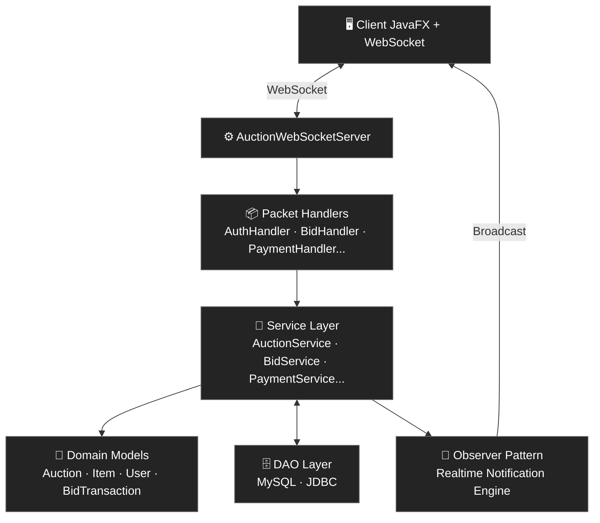
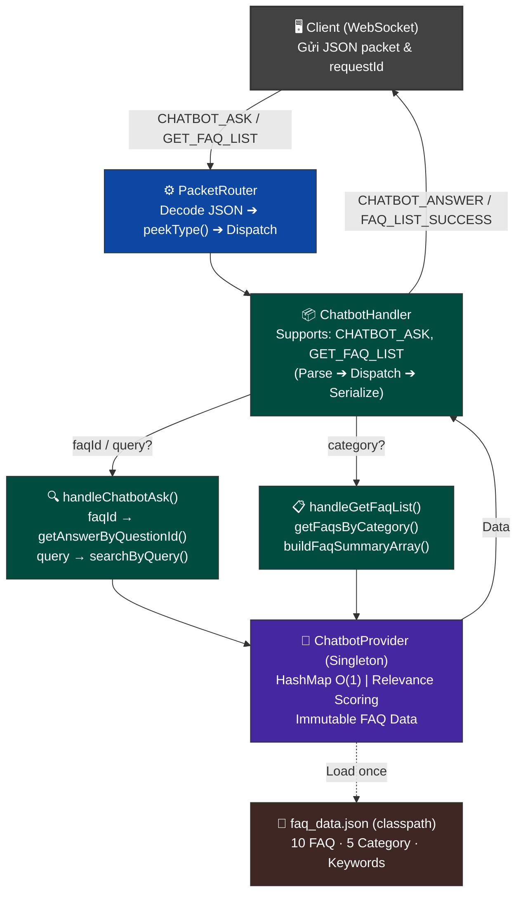

<div align="center">

# OmniBid - Hệ thống Đấu giá Trực tuyến

**Nền tảng đấu giá desktop thời gian thực, xây dựng bằng Java theo mô hình Client-Server.**  
Xử lý đặt giá đồng thời an toàn, broadcast giá tức thì qua WebSocket, và tự động hoá toàn bộ quy trình hậu mãi từ escrow đến hoàn tiền.

---

[](https://github.com/vuxgiakhanh-source/online-auction-system/actions/workflows/maven.yml)


</div>

---

## 🧾 Mục lục

* [Giới thiệu](#-giới-thiệu)
* [Demo](#-demo)
* [Đặc điểm kĩ thuật nổi bật](#-đặc-điểm-kĩ-thuật-nổi-bật)
* [Chức năng hệ thống](#-chức-năng-hệ-thống)
    * [Chức năng cốt lõi](#chức-năng-cốt-lõi)
    * [Chức năng nâng cao](#chức-năng-nâng-cao)
* [Kiến trúc hệ thống](#-kiến-trúc-hệ-thống)
    * [Kiến trúc tổng quan](#kiến-trúc-tổng-quan)
    * [Kiến trúc chatbot](#-kiến-trúc-chatbot)
    * [Cấu trúc project](#-cấu-trúc-project)
    * [Design Patterns áp dụng](#design-patterns-áp-dụng)
* [Tech Stack](#-tech-stack)
* [Hướng dẫn cài đặt](#-hướng-dẫn-cài-đặt)
  * [Yêu cầu](#yêu-cầu)
  * [Các bước cài đặt](#các-bước-cài-đặt)
  * [Troubleshooting](#troubleshooting)
* [Testing](#-testing)
* [Công nghệ & Công cụ sử dụng](#-công-nghệ--công-cụ-sử-dụng)
* [Đội ngũ & Phân công nhiệm vụ (Team Section & Project Roadmap))](#-đội-ngũ--phân-công-nhiệm-vụ-team-section--project-roadmap)
  * [Đội ngũ](#-đội-ngũ)
  * [Tổng quan Timeline](#-tổng-quan-timeline)
* [Liên hệ](#-liên-hệ)
* [License](#-license)

___

## 🚀 Giới thiệu
**OmniBid** là nền tảng đấu giá trực tuyến dạng desktop app, giải quyết các bài toán kỹ thuật cốt lõi của một hệ thống đấu giá thực tế.

Hệ thống cho phép người bán (Seller) dễ dàng đăng tải các sản phẩm đa dạng, trong khi người mua (Bidder) có thể tham gia đấu thầu cạnh tranh gay gắt để sở hữu món đồ với mức giá phù hợp nhất thông qua cơ chế thị trường thực thụ.

Không dừng lại ở việc đơn thuần kết nối người mua và người bán, **OmniBid** tập trung giải quyết triệt để những bài toán khó của hệ thống phân tán: xử lý **đấu giá đồng thời** an toàn, ngăn chặn Race Condition, **cập nhật giá realtime** cho hàng trăm người dùng cùng lúc thông qua WebSocket, cùng với **quy trình hậu mãi** chuyên nghiệp (escrow payment, Quality Report, hoàn tiền tự động, Second Chance Offer…).

Dự án được phát triển bằng Java theo mô hình Client-Server, áp dụng sâu các nguyên lý **OOP** cùng nhiều **Design Patterns** quan trọng (State, Observer, Strategy, Factory, Singleton). Nhờ đó, **OmniBid** không chỉ hoạt động mượt mà mà còn có kiến trúc sạch, dễ mở rộng và bảo trì.
> Add ảnh demo mô phỏng ứng dụng hoạt động (ghép 2-3 màn hình (Login, 
> Auction List, Bidding Detail) vào một khung ảnh)

---

## 🎬 Demo
> Ghép 2-3 màn hình (Login / Auction / Bidding Detail) vào 1 khung rồi add

---

## 👷 Chức năng hệ thống
### Chức năng cốt lõi
* __Quản lý tài khoản và Phân quyền__: Hệ thống phân quyền chi tiết cho 03 nhóm đối tượng: Bidder (Người mua), Seller (Người bán) và Admin (Quản trị viên), đảm bảo tính bảo mật và đúng vai trò trong mọi tác vụ.


* __Phiên đấu giá linh hoạt (Smart Scheduler)__: Điều phối trạng thái phiên đấu giá hoàn toàn tự động theo thời gian thực (từ __OPEN → RUNNING → FINISHED__). Hệ thống đảm bảo tính chính xác tuyệt đối trong việc đóng/mở thầu.
> Add ảnh log của Server hiển thị chuyển trạng thái tự động (GIF)

* __Đấu giá Realtime & Thông báo__: Tích hợp cập nhật giá thầu tức thì (Realtime) trên toàn bộ client. Hệ thống thông báo giúp người dùng cập nhật trạng thái thắng / thua thầu ngay cả khi đang offline / online.

```mermaid
sequenceDiagram
    autonumber
    participant B as Bidder
    participant S as AuctionWebSocketServer
    participant L as AuctionLockRegistry
    participant SVC as BidService
    participant DB as Database
    participant OB as Other Bidders

    Note over B, OB: Quy trình đặt giá thầu Realtime (OmniBid)

    B->>S: Gửi Packet [PlaceBid]
    
    rect rgb(40, 45, 50)
        Note right of S: Concurrency Control
        S->>L: Acquire Lock (per-auction)
        L-->>S: Lock Acquired
    end

    S->>SVC: placeBid()
    
    activate SVC
    SVC->>SVC: Validate Bid (amount, status, session...)
    SVC->>SVC: Apply Strategy (Anti-Sniping + AutoBid)
    
    SVC->>DB: Update price & Save BidTransaction
    DB-->>SVC: Success
    
    SVC-->>S: Return Success Result
    deactivate SVC

    par Broadcast Realtime
        S->>OB: Notify via Observer Pattern (Price Update)
        S->>B: Notify Bid Result (Success)
    end

    S->>L: Release Lock
    Note over S, L: Mở khóa cho lượt bid tiếp theo
```

> Add ảnh 2 màn hình Client đang đấu giá với nhau và giá nhảy realtime (GIF)

* __Hệ thống Tài chính & Hậu mãi__: Tích hợp ví nội bộ xử lý thanh toán tự động khi kết thúc phiên (PAID). Cung cấp cơ chế __Báo cáo chất lượng (Quality Report)__ và __Hoàn tiền (Refund)__ tự động nếu sản phẩm không đúng cam kết, bảo vệ tối đa quyền lợi người mua.

```mermaid
sequenceDiagram
    autonumber
    participant W as Winner
    participant S as AuctionWebSocketServer
    participant PS as PaymentService
    participant DB as Database
    participant BNK as SystemBank
    participant SEL as Seller

    Note over W, SEL: Quy trình Thanh toán Ký quỹ (Escrow Payment)

    S->>S: Auction Finished (Timer Trigger)
    S->>PS: processAuctionCompletion()
    
    activate PS
    PS->>DB: Lấy thông tin Winner & Final Price
    
    rect rgb(30, 40, 50)
        Note right of PS: Giai đoạn Ký quỹ (Escrow)
        PS->>BNK: Hold Escrow Amount (Tạm giữ tiền)
        BNK-->>PS: Escrow Success
    end
    
    PS->>DB: Create FinancialTransaction
    PS-->>W: Notify "Vui lòng xác nhận thanh toán"
    deactivate PS

    W->>S: Gửi Packet [ConfirmPayment]
    S->>PS: completePayment()

    activate PS
    PS->>BNK: Transfer to Seller (Sau khi trừ phí hệ thống)
    BNK-->>PS: Transfer Success
    PS->>DB: Update Auction Status = PAID
    
    par Thông báo kết quả
        PS-->>W: Notify "Thanh toán thành công"
        PS-->>SEL: Notify "Đã nhận tiền từ phiên đấu giá"
    end
    deactivate PS
```



### Chức năng nâng cao
* __Auto-Bidding (Đấu giá tự động)__: Cho phép người dùng thiết lập mức giá tối đa và bước giá để hệ thống tự động trả giá thay thế khi có đối thủ mới mà không cần trực tuyến liên tục.
> Add ảnh chụp giao diện người dùng thiết lập AutoBidding


* __Thuật toán Anti-Sniping__: Tự động gia hạn thời gian kết thúc nếu có lượt đặt giá phát sinh vào những giây cuối cùng, đảm bảo tính công bằng cho người dùng.


* __Trực quan hóa dữ liệu__: Hiển thị biểu đồ đường (Line Chart) biểu diễn lịch sử đấu giá theo thời gian thực, giúp người dùng phân tích xu hướng và đưa ra quyết định đặt giá chính xác.
> Ảnh chụp LineChart trong chương trình

* __Đề nghị Cơ hội Thứ hai (Second Chance Offer)__: Khi người thắng cuộc không thực hiện thanh toán đúng hạn, hệ thống sẽ tự động gửi đề nghị cho người xếp thứ hai với mức giá cao nhất tiếp theo.


* __Thanh toán Ký quỹ & Xử lý Khiếu nại__: Áp dụng cơ chế Escrow (giữ tiền qua SystemBank) để bảo vệ người mua. Sau khi nhận hàng, người mua có thể gửi **Báo cáo chất lượng (Quality Report)**. Admin duyệt báo cáo hợp lệ sẽ tiến hành hoàn tiền tự động cho người mua và trừ tiền người bán.


* __Hệ thống Đánh giá Người dùng (Rating Service)__: Tự động theo dõi và cập nhật điểm đánh giá của người dùng dựa trên lịch sử giao dịch. Người dùng vi phạm nhiều lần (không giao hàng, khiếu nại không hợp lý...) sẽ bị tạm ngưng hoặc khóa tài khoản theo quy định.


* __Hỗ trợ khách hàng thông minh (Smart Chatbot)__: Tích hợp trợ lý ảo ngay trên giao diện JavaFX, hỗ trợ giải đáp thắc mắc về quy trình đấu giá, chính sách thanh toán và tìm kiếm phiên đấu giá nhanh thông qua từ khóa.

  * __Tra cứu FAQ__: Trả về câu trả lời tức thì cho các câu hỏi thường gặp.

  * __Tìm kiếm thông minh__: Sử dụng thuật toán tính điểm liên quan (Relevance Scoring) để gợi ý thông tin chính xác nhất.

---

## ✨ Đặc điểm kĩ thuật nổi bật
Hệ thống được phát triển với các tiêu chuẩn kỹ thuật:
* __Real-time Engine__: Sử dụng mô hình __Observer Pattern__ kết hợp với 
__Socket__ để cập nhật biến động giá ngay lập tức tới tất cả các client 
mà không cần tải lại trang.
> Add ảnh mô tả luồng hoạt động của 1 Bidder (Bidder → Server → BroadCast
> tới các Bidders khác) (GIF)


* __Concurrency Control__: Giải quyết triệt để các vấn đề Lost Update và Race Condition trong kịch bản nhiều người cùng đặt giá tại một mili giây.


* __Cấu trúc hướng đối tượng (OOP)__: Áp dụng chặt chẽ 4 nguyên lý OOP __(Đóng gói, Kế thừa, Đa hình, Trừu tượng)__ cùng các mẫu thiết kế __Factory Method, Singleton, Strategy, Observer và State__ để quản lý logic nghiệp vụ phức tạp.


* __Kiến trúc MVC Phân tầng:__ Tách biệt hoàn toàn giao diện (Client side) và logic xử lý dữ liệu (Server side) qua ___mô hình Client-Server___. Tách biệt rõ ràng các tầng (Network, Handler, Service, Domain, DAO, Observer).
> Add ảnh MVC Diagram

---

## 🏗️ Kiến trúc hệ thống
Hệ thống được thiết kế theo kiến trúc __Layered Architecture__ kết hợp __Event-Driven Architecture__ mạnh mẽ trên mô hình __Client-Server__
### 🏛️ Kiến trúc tổng quan


### 🤖 Kiến trúc chatbot

Chatbot được xây dựng theo mô hình hướng sự kiện (Event-Driven), tách biệt hoàn toàn giữa tầng điều phối (Handler) và tầng cung cấp dữ liệu (Provider).
* __PacketRouter__: Giải mã và điều phối các gói tin CHATBOT_ASK hoặc CHATBOT_GET_FAQ_LIST.
* __ChatbotProvider__ (Singleton): Đảm bảo hiệu năng bằng cách nạp dữ liệu từ faq_data.json một lần duy nhất vào bộ nhớ và hỗ trợ truy vấn $O(1)$ qua HashMap.



### 📂 Cấu trúc project

Project được tổ chức theo kiến trúc **Multi-module Maven**:

```text
online-auction-system/
│
├── auction-common/                  # Module dùng chung (Client & Server)
│   └── src/main/java/
│       ├── dto/                     # Data Transfer Objects (Auth, Bid, Auction, Payment...)
│       └── protocol/                # Packet, PacketType, PacketCodec (Gson-based)
│
├── auction-server/                  # Module Server
│   └── src/main/java/
│       ├── model/
│       │   ├── bank/                # SystemBank
│       │   ├── chatbot/             # ChatbotHandler, ChatbotResponse, FAQ,...
│       │   ├── entity/              # Entity (abstract base)
│       │   ├── user/                # User → NormalUser, Admin, SystemAdmin + Factories
│       │   ├── item/                # Item → Electronics, Art, Vehicle + Factories
│       │   ├── auction/             # Auction + State pattern (5 states), AuctionWinner
│       │   └── bid/                 # BidTransaction, FinancialTransaction, QualityReport
│       ├── service/                 # AccountService, AuctionService, BidService, PaymentService...
│       ├── dao/                     # AuctionDAO, UserDAO, ItemDAO, SecondChanceOfferDAO...
│       ├── network/server/          # AuctionWebSocketServer, PacketRouter, Handlers
│       ├── observer/                # AuctionObserver interface + 4 implementations
│       ├── strategy/                # BidStrategy, AutoBidStrategy, AuctionLockRegistry
│       └── manager/                 # AuctionManager (Singleton)
│
└── auction-client/                  # Module Client
    └── src/main/java/
        ├── network/client/          # AuctionWebSocketClient, ClientPacketDispatcher, Session
        └── ui/                      # JavaFX Controllers & Views
```

### Design Patterns áp dụng:
| Pattern            | Implementation                                                                              | Mục đích hệ thống |
|--------------------|---------------------------------------------------------------------------------------------|----------------------------------|
| **State**          | `AuctionState` → `OpenState`, `RunningState`, `FinishedState`, `PaidState`, `CanceledState` | Quản lý logic chuyển đổi trạng thái phiên đấu giá (Mở → Chạy → Kết thúc) một cách tự động và rõ ràng. |
| **Observer**       | `AuctionObserver` → `BidderObserver`, `SellerObserver`, `AdminObserver`, `StaffObserver`    | Đẩy thông báo thay đổi giá và trạng thái đến toàn bộ người tham gia ngay lập tức (Realtime). |
| **Strategy**       | `BidStrategy`                                                                               | Linh hoạt giữa các chế độ đặt giá thủ công và Auto-Bidding. |
| **Factory Method** | `ItemFactory`, `UserFactory`                                                                | Chuẩn hóa việc tạo các loại Item (Electronics, Art, Vehicle...) và User. |
| **Singleton**      | `AuctionManager`, `DatabaseConnection`, `ChatbotProvider`                                    | Đảm bảo chỉ tồn tại duy nhất một instance cho các thành phần quản lý toàn cục. |

---


## ⚙️ Tech Stack

| Lớp               | Công nghệ         | Phiên bản   | Vai trò                                   |
|-------------------|-------------------|-------------|-------------------------------------------|
| **Language**      | Java              | 17 LTS      | Ngôn ngữ chính, áp dụng OOP & concurrency |
| **Build**         | Apache Maven      | 3.8+        | Multi-module project management           |
| **UI**            | JavaFX            | 17          | Desktop client, kiến trúc MVC             |
| **Networking**    | Java-WebSocket    | 1.5.5       | Real-time bidding & notifications         |
| **Database**      | MySQL             | 8.0+        | Persistent storage                        |
| **Serialization** | Gson              | 2.10.1      | Object ↔ JSON qua network                 |
| **Testing**       | JUnit 5 + Mockito | 5.10 / 5.2  | Unit tests & mock isolation               |
| **Boilerplate**   | Lombok            | 1.18.38     | Giảm boilerplate code                     |
| **CI**            | GitHub Actions    | —           | Auto build & test trên mỗi push           |
| **Code Style**    | Google Java Style | —           | Quy chuẩn code thống nhất toàn dự án      |

---

## 💡 Hướng dẫn cài đặt

### Yêu cầu :
| Công cụ      | Phiên bản                    | Kiểm tra          |
|--------------|------------------------------|-------------------|
| JDK          | 17 LTS (khuyên dùng Temurin) | `java -version`   |
| Apache Maven | 3.8+                         | `mvn -version`    |
| MySQL        | 8.0+                         | `mysql --version` |

⚠️ **Quan trọng:** MySQL phải đang chạy trước khi khởi động server.

### Các bước cài đặt 
#### 1. Clone repository

```bash
git clone https://github.com/vuxgiakhanh-source/online-auction-system.git
cd online-auction-system
```

#### 2. Tạo Database

```bash
mysql -u root -p < auction-server/src/main/resources/database/database.sql
```
> Add ảnh chụp MySQL Workbench hoặc terminal sau khi import thành công.

#### 3. Cấu hình kết nối

Chỉnh sửa file `auction-server/src/main/resources/data.properties`:

```properties
db.host=localhost
db.port=3306
db.name=auction_db
db.user=root
db.password=your_password
server.port=8887
```

> 🔒 **Bảo mật:** Không commit file này kèm mật khẩu thật lên repository.

#### 4. Build toàn bộ project

```bash
# Build và bỏ qua tests (nhanh hơn)
mvn clean install -DskipTests

# Build kèm chạy toàn bộ unit tests
mvn clean install
```

#### 5. Khởi động Server

```bash
cd auction-server
mvn exec:java
```

Chờ xuất hiện thông báo: `[Server] Started on port 8887`

#### 6. Khởi động Client _(terminal mới)_

```bash
cd auction-client
mvn javafx:run
```

> **Lưu ý:** Client mặc định kết nối đến `localhost:8887`. Nếu server chạy trên máy khác, cập nhật host trong file cấu hình của `auction-client`.

---

### Troubleshooting

| Lỗi                                 | Nguyên nhân           | Cách xử lý                                |
|-------------------------------------|-----------------------|-------------------------------------------|
| `Communications link failure`       | MySQL chưa chạy       | Khởi động MySQL service trước             |
| `Address already in use: 8887`      | Port 8887 bị chiếm    | Đổi `server.port` trong `data.properties` |
| `JavaFX runtime components missing` | Sai phiên bản Java    | Đảm bảo dùng JDK 17, không phải JRE       |
| `BUILD FAILURE` khi `mvn install`   | Test fail do thiếu DB | Dùng `-DskipTests` hoặc setup DB trước    |

---

## 🧪 Testing

Project có **40 unit test classes** và **hơn 2000 unit tests đã passed** bao phủ tất cả các tầng quan trọng của hệ thống. Tests không yêu cầu kết nối database — toàn bộ dependencies được mock bằng Mockito.

```bash
# Chạy toàn bộ tests
mvn clean test

# Chạy tests của riêng server module
cd auction-server && mvn test
```

### Phân bổ test theo tầng

| Tầng                       | Test Classes                                                                                                                                                                                | Scenarios tiêu biểu                                 |
|----------------------------|---------------------------------------------------------------------------------------------------------------------------------------------------------------------------------------------|-----------------------------------------------------|
| **Domain / State Machine** | `AuctionTest`, `AuctionStateMachineTest`, `AuctionWinnerTest`, `SecondChanceOfferTest`                                                                                                      | State transitions, winner determination, edge cases |
| **Concurrency**            | `AuctionLockRegistryTest`, `ChatbotProviderTest`                                                                                                                                            | Per-auction locking, race condition prevention      |
| **Strategy**               | `StandardBidStrategyTest`, `AutoBidStrategyTest`, `BidStrategyContractTest`, `AutoBidProcessorTest`                                                                                         | Bidding logic, contract testing trên interface      |
| **Observer**               | `BidderObserverTest`, `SellerObserverTest`, `AdminObserverTest`, `AuctionObserverContractTest`, `AuctionEventTest`                                                                          | Notification propagation, contract tests            |
| **Service**                | `BidServiceTest`, `PaymentServiceTest`, `AuctionServiceTest`, `AccountServiceTest`, `WalletServiceTest`, `RatingServiceTest`, `QualityReportServiceTest`, `ChatbotProviderTest`             | Business logic, payment flows                       |
| **Factory**                | `UserFactoryTest`, `ItemFactoryTest`, `UserFactoryTest`                                                                                                                                     | Object creation, type correctness                   |
| **Singleton**              | `AuctionManagerTest`, `SystemBankTest`, `ChatbotProviderTest`                                                                                                                               | Single-instance guarantee                           |

---

## 👥 Đội ngũ & Phân công nhiệm vụ (Team Section & Project Roadmap)

### 🧠 Đội ngũ
|                                            Thành viên                                               | Vai trò                                                      | Nhiệm vụ chính                                                                                                    |               Tiến độ                |  Trạng thái     |
|:---------------------------------------------------------------------------------------------------:|:-------------------------------------------------------------|:------------------------------------------------------------------------------------------------------------------|:------------------------------------:|:---------------:|
|             <br/>**Hồ Huyền Chi**             | **Trưởng nhóm** <br/> OOP Design <br/> Testing               | · Core auction logic <br/> · Code review & refactor <br/> · Tài liệu <br/> · Unit tests <br/> · Integration tests |  | 🏗️ In Progress |
| <br/>**Vũ Gia Khánh** | **Thành viên** <br/> Concurrency <br/> Testing <br/> Network | · Network & concurrency <br/> · Advanced features <br/> · Network tests <br/> · System tests                      |  | 🏗️ In Progress |
|       <br/>**Bạch Quốc Thịnh**       | **Thành viên** <br/> Backend <br/> Database                  | · Database design <br/> · DAO layer <br/> · Anti-Sniping <br/> · Scheduler Building <br/> · Notification Layer    |  | 🏗️ In Progress |
|     <br/>**Trần Thảo Nhi**     | **Thành viên** <br/> Frontend                                | · Toàn bộ JavaFX UI <br/> · Client module <br/> · Tài liệu                                                        |  | 🏗️ In Progress |


### 📅 Tổng quan Timeline

```
Tuần 1         Tuần 2–3          Tuần 4–5              Tuần 6         Tuần 7           Tuần 8
[Phase 1] ──▶ [Phase 2] ──────▶ [Phase 3] ─────────▶ [Phase 4] ──▶ [Phase 5] ─────▶ [Phase 6]
Foundation    Core Logic        Advanced Features      Testing       Integration     Polish & Deploy
24/3–30/3     31/3–13/4         14/4–27/4              28/4–11/5     12/5–18/5       19/5–25/5
```
 
⭐ [Chi tiết phase 1](./CONTRIBUTORS.md#-phase-1--project-foundation--architecture-design)  
⭐ [Chi tết phase 2](./CONTRIBUTORS.md#-phase-2--core-domain--data-layer-implementation)  
⭐ [Chi tiết phase 3](./CONTRIBUTORS.md#-phase-3--advanced-features--business-logic-completion)  
⭐ [Chi tiết phase 4](./CONTRIBUTORS.md#-phase-4--testing--quality-assurance)  
⭐ [Chi tiết phase 5](./CONTRIBUTORS.md#-phase-5--integration-cicd--containerization)  
⭐ [Chi tiết phase 6](./CONTRIBUTORS.md#-phase-6--documentation-polish--demo-preparation)

---

## 📞 Liên hệ

| Thành viên      | Trách nhiệm           | GitHub                                                          | Email                    |
|-----------------|-----------------------|-----------------------------------------------------------------|--------------------------|
| Hồ Huyền Chi    | Core Logic · OOP      | [@hchyy](https://github.com/hchyy)                              | chidinhhoi1709@gmail.com |
| Vũ Gia Khánh    | Concurrency · Testing | [@vuxgiakhanh-source](https://github.com/vuxgiakhanh-source)    | vuxgiakhanh@gmail.com    |
| Bạch Quốc Thịnh | Database · Backend    | [@thebrosaythree](https://github.com/thebrosaythree)            | iamven56@gmail.com       |
| Trần Thảo Nhi   | Frontend              | [@bingbongg](https://github.com/bingbongg)                      | tthaonhi0127@gmail.com   |

---

## 📄 License

__MIT © 2026 Group 13 - OmniBid__
