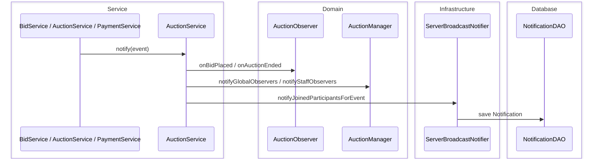
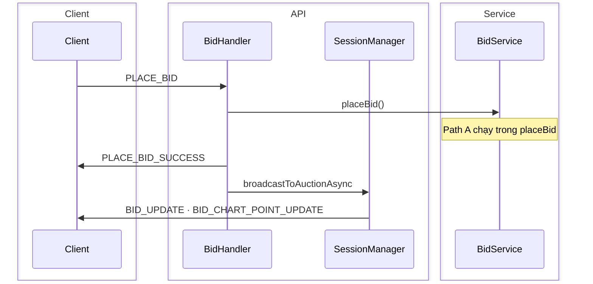

# Realtime Broadcast & Notification

Server có **hai kênh** độc lập: (A) domain notify + inbox DB, (B) WebSocket bid trực tiếp từ `BidHandler`.  
Diagram sequence cho từng kênh; không coi `AuctionObserver` là pipeline WS cho `BID_UPDATE`.

**Mục đích:** Giải thích đúng luồng realtime khi đọc code hoặc viết tài liệu.  
**Use case:** Bidder thấy giá nhảy, inbox thông báo, outbid, auction ended trên UI.  
**Trong code:** `AuctionService.notify`, `ServerBroadcastNotifier`, `SessionManager.broadcastToAuctionAsync`.

| Kênh | Khi nào | Code |
|------|---------|------|
| **A — Domain notify** | Lifecycle, payment, inbox | `AuctionService.notify` → observers + `ServerBroadcastNotifier` → `NotificationDAO` |
| **B — Bid WebSocket** | Giá bid realtime | `BidHandler` → `SessionManager.broadcastToAuctionAsync` |

Class diagram: [RealtimeObserverClassDiagram.md](./RealtimeObserverClassDiagram.md)

## Path A — `AuctionService.notify`

`BidderObserver` dùng `ConsoleNotifier` — **không** gửi WebSocket.

## Path B — Bid WebSocket

Lifecycle/payment WS: `ServerBroadcastNotifier` → `SessionManager` (`AUCTION_ENDED_UPDATE`, `OUTBID_NOTIFY`, …). Timer: `AuctionTimerService.broadcastUpdate`.

Place bid chi tiết: [PlaceBidSequenceDiagram.md](./PlaceBidSequenceDiagram.md)
