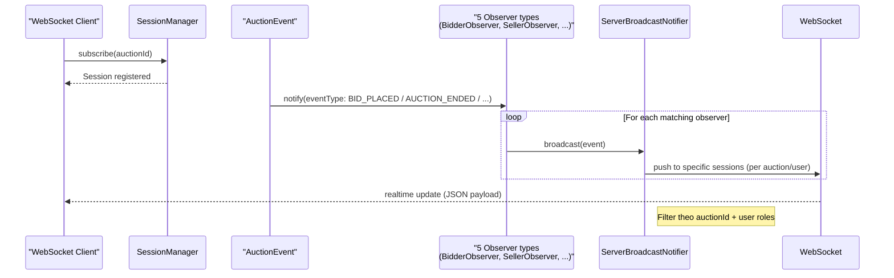

# Real-time BroadCast via Observer

```mermaid
sequenceDiagram
    participant Client as "WebSocket Client"
    participant SessionManager
    participant AuctionEvent as "AuctionEvent"
    participant Observers as "5 Observer types<br/>(BidderObserver, SellerObserver, ...)"
    participant ServerBroadcastNotifier
    participant WebSocket

    Client->>SessionManager: subscribe(auctionId)
    SessionManager-->>Client: Session registered

    AuctionEvent->>Observers: notify(eventType: BID_PLACED / AUCTION_ENDED / ...)
    
    loop For each matching observer
        Observers->>ServerBroadcastNotifier: broadcast(event)
        ServerBroadcastNotifier->>WebSocket: push to specific sessions (per auction/user)
    end

    WebSocket-->>Client: realtime update (JSON payload)
    Note right of ServerBroadcastNotifier: Filter theo auctionId + user roles
```