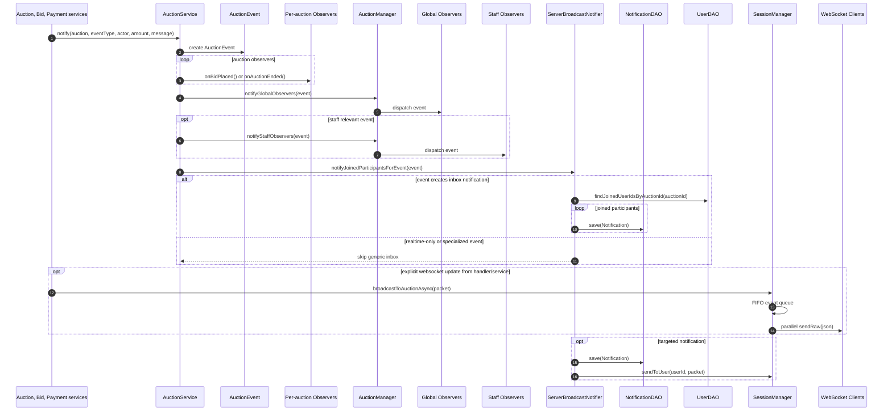

# Realtime Broadcast Via Observer SequenceDiagram

```mermaid
sequenceDiagram
    autonumber
    participant Service as Auction, Bid, Payment services
    participant AuctionSvc as AuctionService
    participant Event as AuctionEvent
    participant PerAuction as Per-auction Observers
    participant Manager as AuctionManager
    participant Global as Global Observers
    participant Staff as Staff Observers
    participant Bridge as ServerBroadcastNotifier
    participant NotifyDAO as NotificationDAO
    participant UserDAO
    participant Sessions as SessionManager
    participant Clients as WebSocket Clients

    Service->>AuctionSvc: notify(auction, eventType, actor, amount, message)
    AuctionSvc->>Event: create AuctionEvent

    loop auction observers
        AuctionSvc->>PerAuction: onBidPlaced() or onAuctionEnded()
    end

    AuctionSvc->>Manager: notifyGlobalObservers(event)
    Manager->>Global: dispatch event

    opt staff relevant event
        AuctionSvc->>Manager: notifyStaffObservers(event)
        Manager->>Staff: dispatch event
    end

    AuctionSvc->>Bridge: notifyJoinedParticipantsForEvent(event)
    alt event creates inbox notification
        Bridge->>UserDAO: findJoinedUserIdsByAuctionId(auctionId)
        loop joined participants
            Bridge->>NotifyDAO: save(Notification)
        end
    else realtime-only or specialized event
        Bridge-->>AuctionSvc: skip generic inbox
    end

    opt explicit websocket update from handler/service
        Service->>Sessions: broadcastToAuctionAsync(packet)
        Sessions->>Sessions: FIFO event queue
        Sessions->>Clients: parallel sendRaw(json)
    end

    opt targeted notification
        Bridge->>NotifyDAO: save(Notification)
        Bridge->>Sessions: sendToUser(userId, packet)
    end
```
