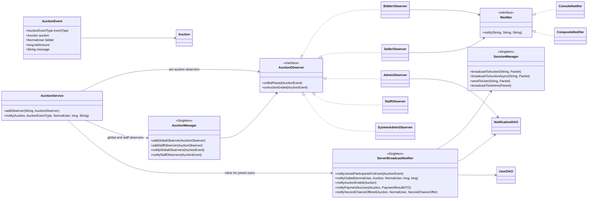

# Realtime Observer Class Diagram

```mermaid
classDiagram
    direction LR

    class AuctionObserver {
        <<interface>>
        +onBidPlaced(AuctionEvent)
        +onAuctionEnded(AuctionEvent)
    }
    class AuctionEvent {
        +AuctionEventType eventType
        +Auction auction
        +NormalUser bidder
        +long bidAmount
        +String message
    }
    class BidderObserver
    class SellerObserver
    class AdminObserver
    class StaffObserver
    class SystemAdminObserver
    class INotifier {
        <<interface>>
        +notify(String, String, String)
    }
    class ConsoleNotifier
    class CompositeNotifier
    class AuctionService {
        +addObserver(String, AuctionObserver)
        +notify(Auction, AuctionEventType, NormalUser, long, String)
    }
    class AuctionManager {
        <<Singleton>>
        +addGlobalObserver(AuctionObserver)
        +addStaffObserver(AuctionObserver)
        +notifyGlobalObservers(AuctionEvent)
        +notifyStaffObservers(AuctionEvent)
    }
    class ServerBroadcastNotifier {
        <<Singleton>>
        +notifyJoinedParticipantsForEvent(AuctionEvent)
        +notifyOutbid(NormalUser, Auction, NormalUser, long, long)
        +notifyAuctionEnded(Auction)
        +notifyPaymentSuccess(Auction, PaymentResultDTO)
        +notifySecondChanceOffered(Auction, NormalUser, SecondChanceOffer)
    }
    class SessionManager {
        <<Singleton>>
        +broadcastToAuction(String, Packet)
        +broadcastToAuctionAsync(String, Packet)
        +sendToUser(String, Packet)
        +broadcastToAdmins(Packet)
    }
    class NotificationDAO
    class UserDAO

    AuctionObserver <|.. BidderObserver
    AuctionObserver <|.. SellerObserver
    AuctionObserver <|.. AdminObserver
    AuctionObserver <|.. StaffObserver
    AuctionObserver <|.. SystemAdminObserver
    INotifier <|.. ConsoleNotifier
    INotifier <|.. CompositeNotifier
    BidderObserver --> INotifier
    SellerObserver --> INotifier
    AdminObserver --> NotificationDAO
    AuctionService --> AuctionObserver : per-auction observers
    AuctionService --> AuctionManager : global and staff observers
    AuctionService --> ServerBroadcastNotifier : inbox for joined users
    AuctionManager --> AuctionObserver
    ServerBroadcastNotifier --> SessionManager
    ServerBroadcastNotifier --> NotificationDAO
    ServerBroadcastNotifier --> UserDAO
    AuctionEvent --> Auction
```
