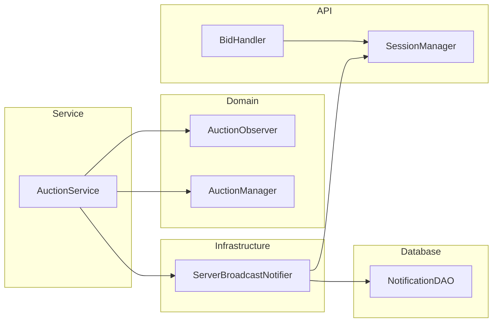

# Realtime Observer Class Diagram

Quan hệ `AuctionObserver`, `AuctionService.notify`, `ServerBroadcastNotifier`, `SessionManager` và `BidHandler` (WS bid).  
Làm rõ observer in-memory (thường `ConsoleNotifier`) khác kênh WebSocket bid.

**Mục đích:** Tránh nhầm Observer pattern = broadcast giá realtime.  
**Use case:** Sửa thông báo inbox, outbid, lifecycle WS; thêm event mới.  
**Trong code:** `com.group13.auction.observer.*`, `ServerBroadcastNotifier`, `BidHandler`.

- **Path A:** `AuctionService.notify` → inbox / observers  
- **Path B:** `BidHandler` → `SessionManager` (bid WS)  

Chi tiết: [RealtimeBroadcastViaObserverSequenceDiagram.md](./RealtimeBroadcastViaObserverSequenceDiagram.md)
