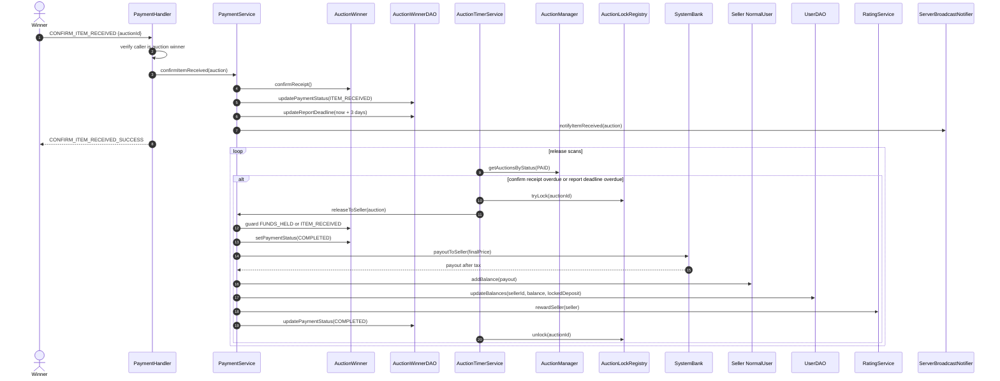

# Seller Payout Sequence Diagram

```mermaid
sequenceDiagram
    autonumber
    actor Winner
    participant Handler as PaymentHandler
    participant PaySvc as PaymentService
    participant WinnerState as AuctionWinner
    participant WinnerDAO as AuctionWinnerDAO
    participant Timer as AuctionTimerService
    participant Manager as AuctionManager
    participant Lock as AuctionLockRegistry
    participant Bank as SystemBank
    participant Seller as Seller NormalUser
    participant UserDAO
    participant Rating as RatingService
    participant Broadcast as ServerBroadcastNotifier

    Winner->>Handler: CONFIRM_ITEM_RECEIVED {auctionId}
    Handler->>Handler: verify caller is auction winner
    Handler->>PaySvc: confirmItemReceived(auction)
    PaySvc->>WinnerState: confirmReceipt()
    PaySvc->>WinnerDAO: updatePaymentStatus(ITEM_RECEIVED)
    PaySvc->>WinnerDAO: updateReportDeadline(now + 3 days)
    PaySvc->>Broadcast: notifyItemReceived(auction)
    Handler-->>Winner: CONFIRM_ITEM_RECEIVED_SUCCESS

    loop release scans
        Timer->>Manager: getAuctionsByStatus(PAID)
        alt confirm receipt overdue or report deadline overdue
            Timer->>Lock: tryLock(auctionId)
            Timer->>PaySvc: releaseToSeller(auction)
            PaySvc->>WinnerState: guard FUNDS_HELD or ITEM_RECEIVED
            PaySvc->>WinnerState: setPaymentStatus(COMPLETED)
            PaySvc->>Bank: payoutToSeller(finalPrice)
            Bank-->>PaySvc: payout after tax
            PaySvc->>Seller: addBalance(payout)
            PaySvc->>UserDAO: updateBalances(sellerId, balance, lockedDeposit)
            PaySvc->>Rating: rewardSeller(seller)
            PaySvc->>WinnerDAO: updatePaymentStatus(COMPLETED)
            Timer->>Lock: unlock(auctionId)
        end
    end
```
