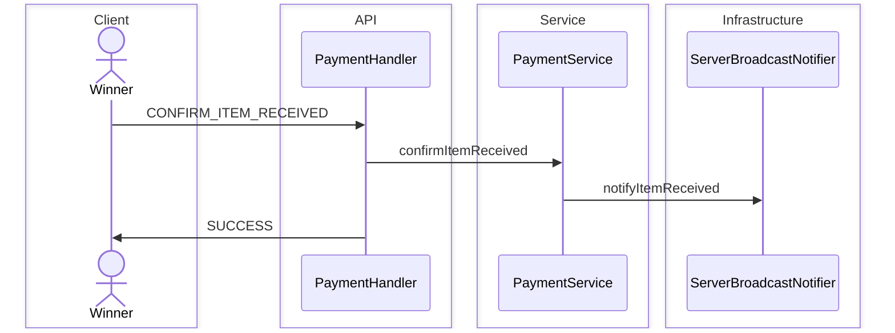
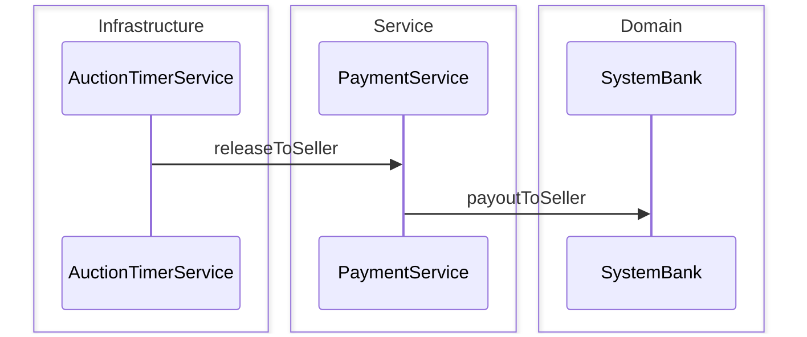

# Seller Payout Sequence Diagram

Sau PAID: winner `CONFIRM_ITEM_RECEIVED` mở cửa sổ báo cáo chất lượng; timer có thể `releaseToSeller` nếu quá hạn xác nhận hoặc report.  
Giải ngân từ `SystemBank` sang ví seller (sau thuế).

**Mục đích:** Trace khi nào seller nhận tiền thực sự.  
**Use case:** Winner bấm đã nhận hàng, auto-release 7 ngày / 3 ngày report, seller balance tăng.  
**Trong code:** `PaymentService.confirmItemReceived`, `releaseToSeller`, `AuctionTimerService` auto-release.

## Winner xác nhận nhận hàng

`PaymentHandler` → `PaymentService.confirmItemReceived`

## Auto-release (timer ~60s)

`AuctionTimerService` → `PaymentService.releaseToSeller` → `SystemBank.payoutToSeller`

