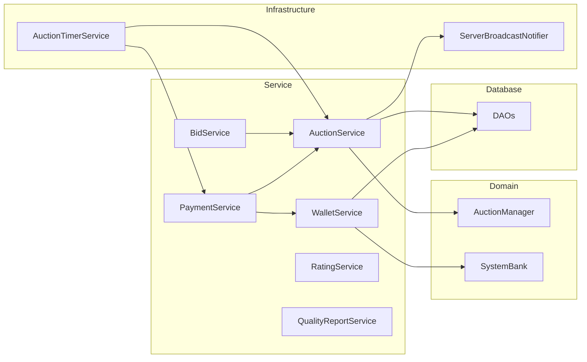

# Service Layer Class Diagram

Các service nghiệp vụ và phụ thuộc tới `AuctionManager`, DAO, `SystemBank`, `AuctionTimerService`, `ServerBroadcastNotifier`.  
Thể hiện quan hệ `BidService` → `AuctionService`, `PaymentService` → `WalletService`, v.v.

**Mục đích:** Nắm ranh giới service và dependency khi sửa logic hoặc thêm API.  
**Use case:** Refactor service, viết integration test, tránh gọi chéo tầng sai.  
**Trong code:** `com.group13.auction.service.*`, composition root `ServerMain`.

| Interface | Class |
|-----------|--------|
| `IAuctionService` | `AuctionService` |
| `IBidService` | `BidService` |
| `IPaymentService` | `PaymentService` |
| `IWalletService` | `WalletService` |
| `IAuctionTimerService` | `AuctionTimerService` |
| `IScheduler` | `TaskScheduler` |
