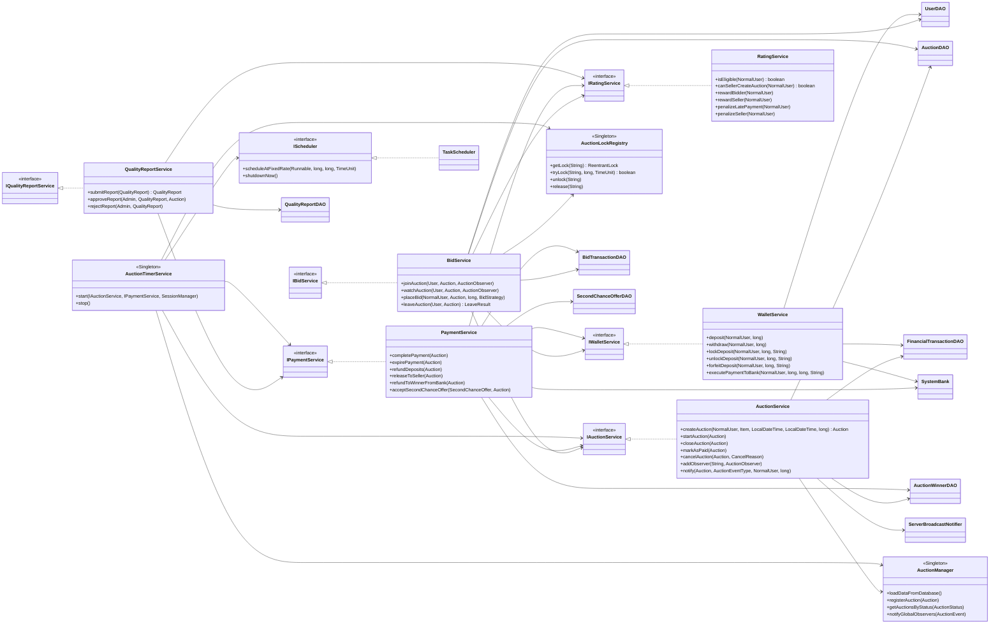

# Service Layer Class Diagram

```mermaid
classDiagram
    direction LR

    class IAuctionService {
        <<interface>>
    }
    class IBidService {
        <<interface>>
    }
    class IPaymentService {
        <<interface>>
    }
    class IWalletService {
        <<interface>>
    }
    class IRatingService {
        <<interface>>
    }
    class IQualityReportService {
        <<interface>>
    }
    class IScheduler {
        <<interface>>
        +scheduleAtFixedRate(Runnable, long, long, TimeUnit)
        +shutdownNow()
    }

    class AuctionService {
        +createAuction(NormalUser, Item, LocalDateTime, LocalDateTime, long) Auction
        +startAuction(Auction)
        +closeAuction(Auction)
        +markAsPaid(Auction)
        +cancelAuction(Auction, CancelReason)
        +addObserver(String, AuctionObserver)
        +notify(Auction, AuctionEventType, NormalUser, long)
    }
    class BidService {
        +joinAuction(User, Auction, AuctionObserver)
        +watchAuction(User, Auction, AuctionObserver)
        +placeBid(NormalUser, Auction, long, BidStrategy)
        +leaveAuction(User, Auction) LeaveResult
    }
    class PaymentService {
        +completePayment(Auction)
        +expirePayment(Auction)
        +refundDeposits(Auction)
        +releaseToSeller(Auction)
        +refundToWinnerFromBank(Auction)
        +acceptSecondChanceOffer(SecondChanceOffer, Auction)
    }
    class WalletService {
        +deposit(NormalUser, long)
        +withdraw(NormalUser, long)
        +lockDeposit(NormalUser, long, String)
        +unlockDeposit(NormalUser, long, String)
        +forfeitDeposit(NormalUser, long, String)
        +executePaymentToBank(NormalUser, long, long, String)
    }
    class RatingService {
        +isEligible(NormalUser) boolean
        +canSellerCreateAuction(NormalUser) boolean
        +rewardBidder(NormalUser)
        +rewardSeller(NormalUser)
        +penalizeLatePayment(NormalUser)
        +penalizeSeller(NormalUser)
    }
    class QualityReportService {
        +submitReport(QualityReport) QualityReport
        +approveReport(Admin, QualityReport, Auction)
        +rejectReport(Admin, QualityReport)
    }
    class AuctionTimerService {
        <<Singleton>>
        +start(IAuctionService, IPaymentService, SessionManager)
        +stop()
    }
    class TaskScheduler
    class AuctionManager {
        <<Singleton>>
        +loadDataFromDatabase()
        +registerAuction(Auction)
        +getAuctionsByStatus(AuctionStatus)
        +notifyGlobalObservers(AuctionEvent)
    }
    class AuctionLockRegistry {
        <<Singleton>>
        +getLock(String) ReentrantLock
        +tryLock(String, long, TimeUnit) boolean
        +unlock(String)
        +release(String)
    }

    IAuctionService <|.. AuctionService
    IBidService <|.. BidService
    IPaymentService <|.. PaymentService
    IWalletService <|.. WalletService
    IRatingService <|.. RatingService
    IQualityReportService <|.. QualityReportService
    IScheduler <|.. TaskScheduler

    AuctionService --> AuctionDAO
    AuctionService --> AuctionWinnerDAO
    AuctionService --> FinancialTransactionDAO
    AuctionService --> AuctionManager
    AuctionService --> ServerBroadcastNotifier
    BidService --> IAuctionService
    BidService --> IRatingService
    BidService --> IWalletService
    BidService --> BidTransactionDAO
    BidService --> AuctionDAO
    BidService --> UserDAO
    BidService --> AuctionLockRegistry
    PaymentService --> IAuctionService
    PaymentService --> IRatingService
    PaymentService --> IWalletService
    PaymentService --> AuctionWinnerDAO
    PaymentService --> SecondChanceOfferDAO
    PaymentService --> BidTransactionDAO
    PaymentService --> SystemBank
    WalletService --> FinancialTransactionDAO
    WalletService --> UserDAO
    WalletService --> SystemBank
    QualityReportService --> IPaymentService
    QualityReportService --> IRatingService
    QualityReportService --> QualityReportDAO
    AuctionTimerService --> AuctionManager
    AuctionTimerService --> IAuctionService
    AuctionTimerService --> IPaymentService
    AuctionTimerService --> IScheduler
    AuctionTimerService --> AuctionLockRegistry
```
