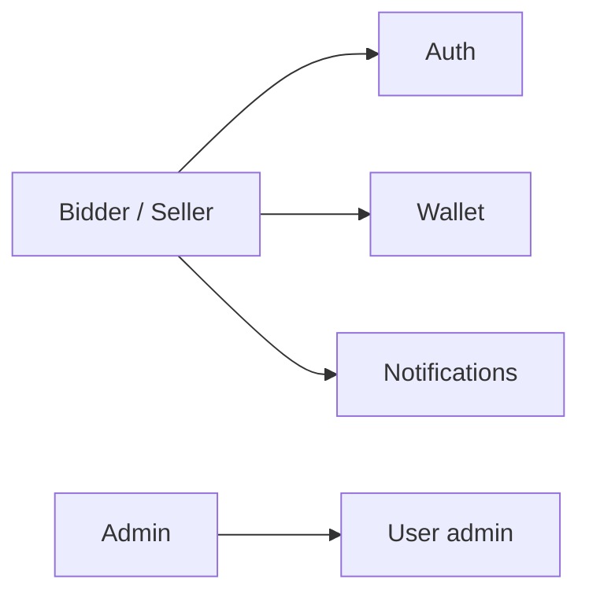
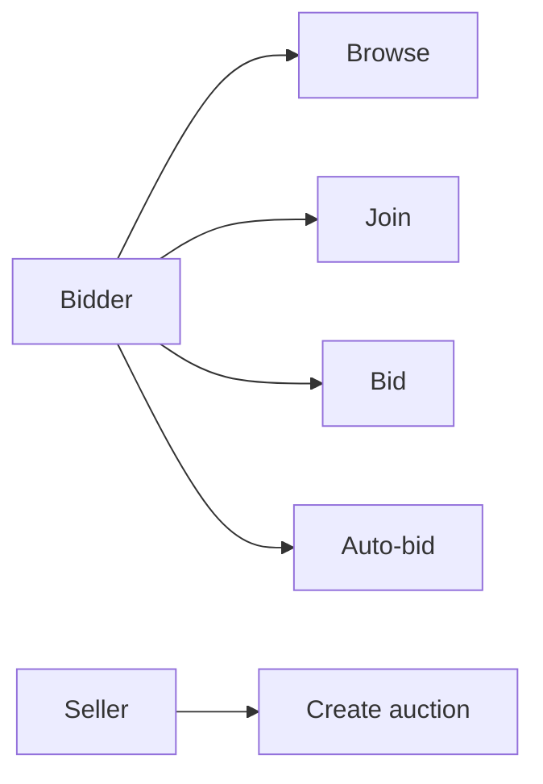
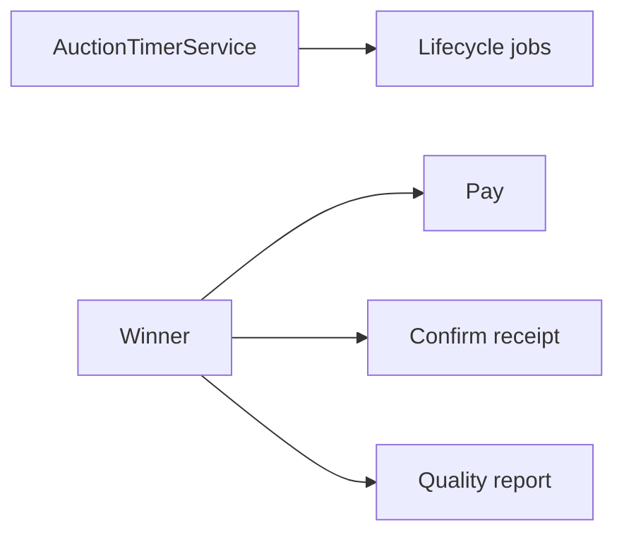

# Use Case Diagram

Góc nhìn nghiệp vụ (actor → capability), không thay sequence diagram.  
Dùng để đối chiếu phạm vi sản phẩm với implementation.

**Mục đích:** Tổng quan chức năng.  
**Use case:** Review scope dự án, map use case → file sequence/class diagram bên dưới.  
**Chi tiết kỹ thuật:** Các file `*SequenceDiagram.md`, `*ClassDiagram.md`.

## Quản lý chung

## Đấu giá

## Hậu mãi

| Use case | Diagram |
|----------|---------|
| Bid | [PlaceBidSequenceDiagram.md](./PlaceBidSequenceDiagram.md) |
| Lifecycle | [AuctionLifecycleSequenceDiagram.md](./AuctionLifecycleSequenceDiagram.md) |
| Payment | [PaymentAndDepositEscrowSequenceDiagram.md](./PaymentAndDepositEscrowSequenceDiagram.md) |
