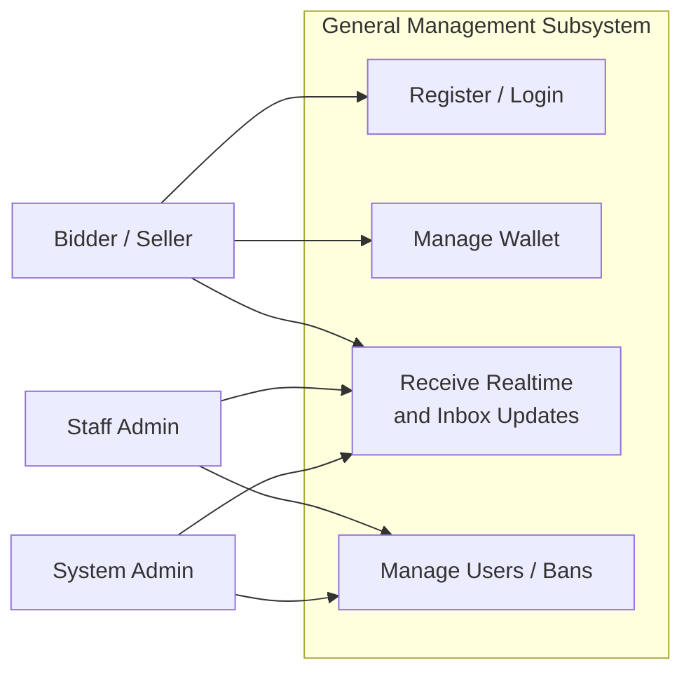
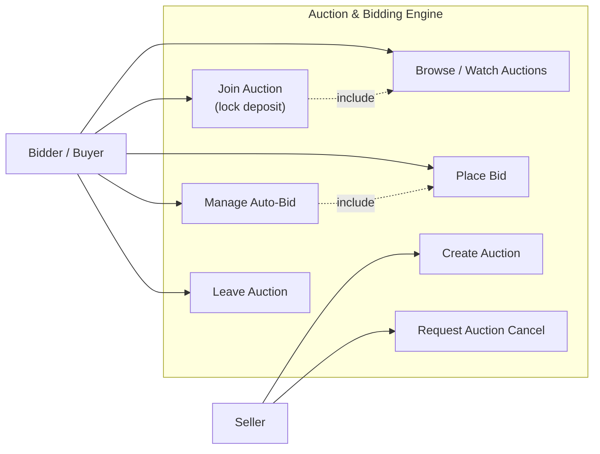
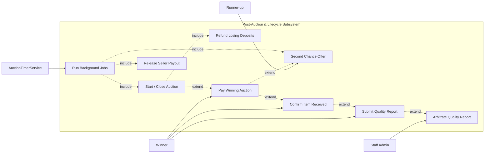

# Use Case Diagram

## General Management Subsystem

```mermaid
flowchart LR
    User["Bidder / Seller"]
    Staff["Staff Admin"]
    SysAdmin["System Admin"]

    subgraph General["General Management Subsystem"]
        UCAuth["Register / Login"]
        UCWallet["Manage Wallet"]
        UCNotify["Receive Realtime<br/>and Inbox Updates"]
        UCAdmin["Manage Users / Bans"]
    end

    User --> UCAuth
    User --> UCWallet
    User --> UCNotify
    Staff --> UCAdmin
    Staff --> UCNotify
    SysAdmin --> UCAdmin
    SysAdmin --> UCNotify
```

## Auction & Bidding Engine

```mermaid
flowchart LR
    Bidder["Bidder / Buyer"]
    Seller["Seller"]

    subgraph Engine["Auction & Bidding Engine"]
        UCBrowse["Browse / Watch Auctions"]
        UCCreate["Create Auction"]
        UCJoin["Join Auction<br/>(lock deposit)"]
        UCBid["Place Bid"]
        UCAutoBid["Manage Auto-Bid"]
        UCLeave["Leave Auction"]
        UCCancelReq["Request Auction Cancel"]
    end

    Bidder --> UCBrowse
    Bidder --> UCJoin
    Bidder --> UCBid
    Bidder --> UCAutoBid
    Bidder --> UCLeave
    Seller --> UCCreate
    Seller --> UCCancelReq

    UCJoin -. include .-> UCBrowse
    UCAutoBid -. include .-> UCBid
```

## Post-Auction & Lifecycle Subsystem

```mermaid
flowchart LR
    Timer["AuctionTimerService"]
    Winner["Winner"]
    RunnerUp["Runner-up"]
    Staff["Staff Admin"]

    subgraph Lifecycle["Post-Auction & Lifecycle Subsystem"]
        UCLifecycle["Start / Close Auction"]
        UCRefund["Refund Losing Deposits"]
        UCPay["Pay Winning Auction"]
        UCSCO["Second Chance Offer"]
        UCConfirm["Confirm Item Received"]
        UCReport["Submit Quality Report"]
        UCArbitrate["Arbitrate Quality Report"]
        UCPayout["Release Seller Payout"]
        UCJobs["Run Background Jobs"]
    end

    Timer --> UCJobs
    Winner --> UCPay
    Winner --> UCConfirm
    Winner --> UCReport
    RunnerUp --> UCSCO
    Staff --> UCArbitrate

    UCJobs -. include .-> UCLifecycle
    UCLifecycle -. include .-> UCRefund
    UCLifecycle -. extend .-> UCPay
    UCPay -. extend .-> UCSCO
    UCPay -. extend .-> UCConfirm
    UCConfirm -. extend .-> UCReport
    UCReport -. extend .-> UCArbitrate
    UCJobs -. include .-> UCPayout
    UCJobs -. include .-> UCSCO
```
