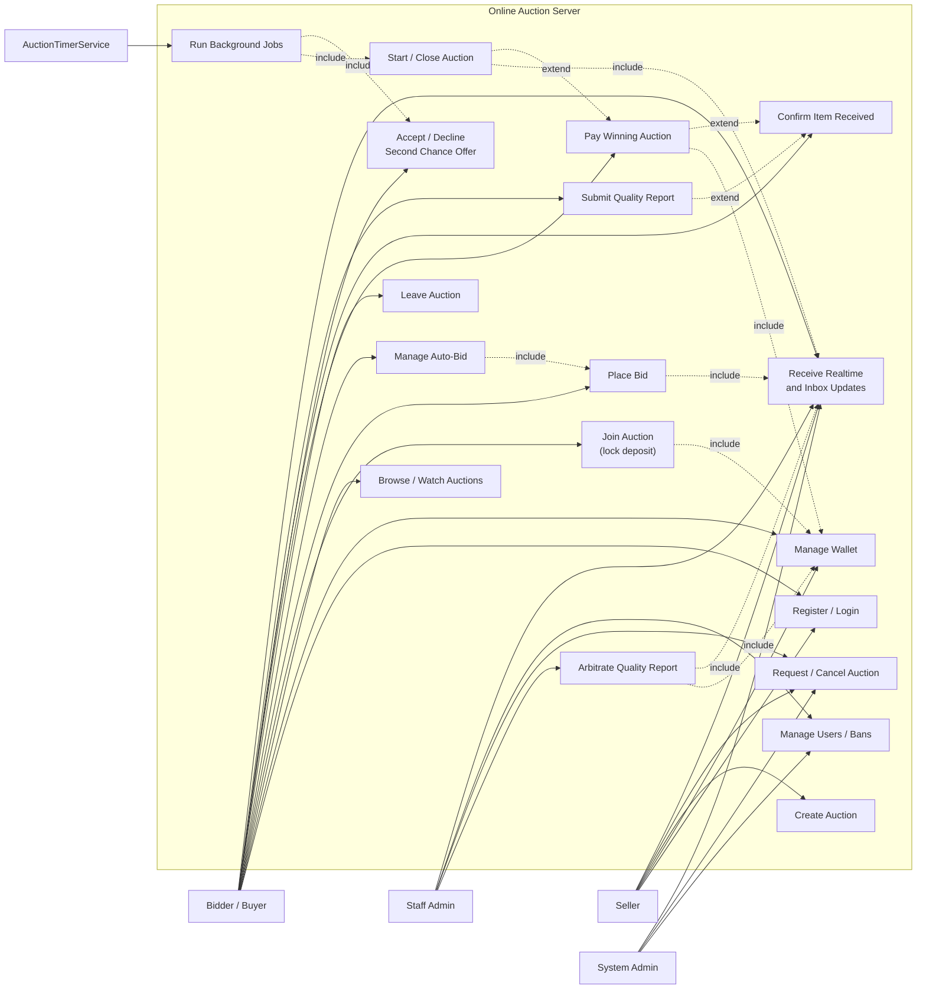

# Use Case Diagram

```mermaid
flowchart LR
    Bidder["Bidder / Buyer"]
    Seller["Seller"]
    Staff["Staff Admin"]
    SysAdmin["System Admin"]
    Timer["AuctionTimerService"]

    subgraph AuctionSystem["Online Auction Server"]
        UCAuth["Register / Login"]
        UCWallet["Manage Wallet"]
        UCBrowse["Browse / Watch Auctions"]
        UCJoin["Join Auction<br/>(lock deposit)"]
        UCBid["Place Bid"]
        UCAutoBid["Manage Auto-Bid"]
        UCLeave["Leave Auction"]
        UCCreate["Create Auction"]
        UCCancel["Request / Cancel Auction"]
        UCLifecycle["Start / Close Auction"]
        UCPay["Pay Winning Auction"]
        UCSCO["Accept / Decline<br/>Second Chance Offer"]
        UCConfirm["Confirm Item Received"]
        UCReport["Submit Quality Report"]
        UCArbitrate["Arbitrate Quality Report"]
        UCNotify["Receive Realtime<br/>and Inbox Updates"]
        UCAdmin["Manage Users / Bans"]
        UCSchedule["Run Background Jobs"]
    end

    Bidder --> UCAuth
    Bidder --> UCWallet
    Bidder --> UCBrowse
    Bidder --> UCJoin
    Bidder --> UCBid
    Bidder --> UCAutoBid
    Bidder --> UCLeave
    Bidder --> UCPay
    Bidder --> UCSCO
    Bidder --> UCConfirm
    Bidder --> UCReport
    Bidder --> UCNotify

    Seller --> UCAuth
    Seller --> UCWallet
    Seller --> UCCreate
    Seller --> UCCancel
    Seller --> UCNotify

    Staff --> UCArbitrate
    Staff --> UCCancel
    Staff --> UCAdmin
    Staff --> UCNotify

    SysAdmin --> UCAdmin
    SysAdmin --> UCCancel
    SysAdmin --> UCNotify

    Timer --> UCSchedule

    UCJoin -. include .-> UCWallet
    UCBid -. include .-> UCNotify
    UCAutoBid -. include .-> UCBid
    UCLifecycle -. include .-> UCNotify
    UCLifecycle -. extend .-> UCPay
    UCSchedule -. include .-> UCLifecycle
    UCSchedule -. include .-> UCSCO
    UCPay -. include .-> UCWallet
    UCPay -. extend .-> UCConfirm
    UCReport -. extend .-> UCConfirm
    UCArbitrate -. include .-> UCWallet
    UCArbitrate -. include .-> UCNotify
```
